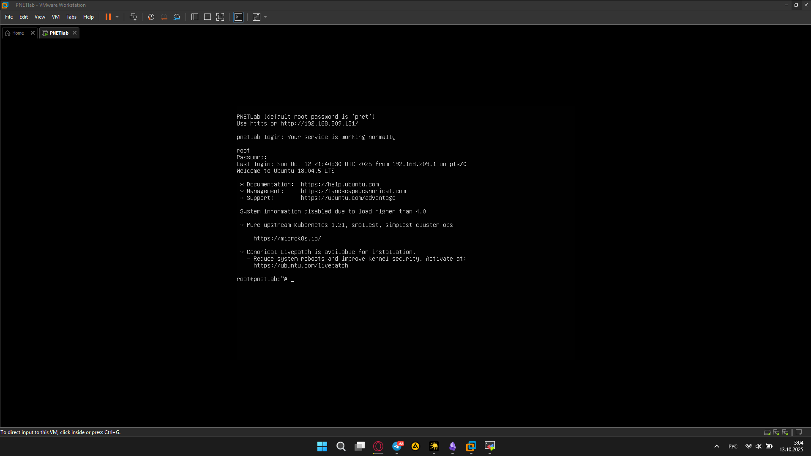
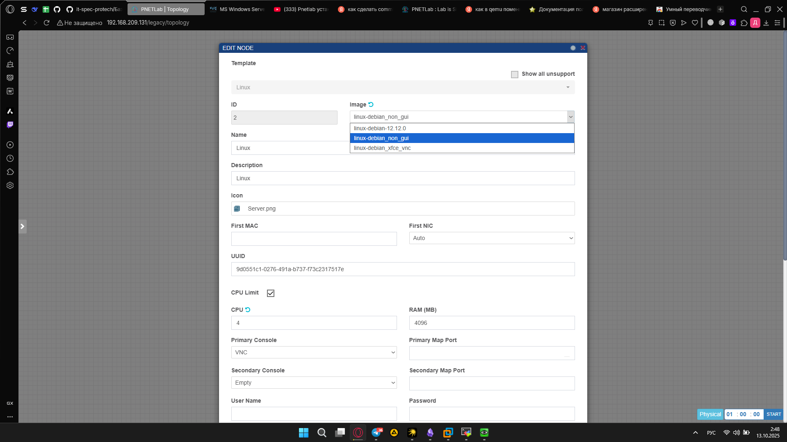
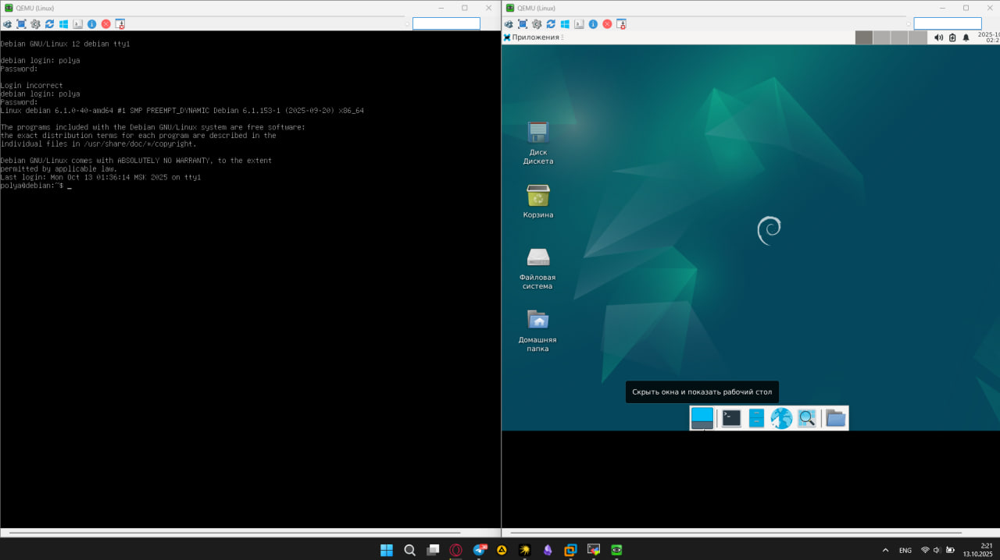
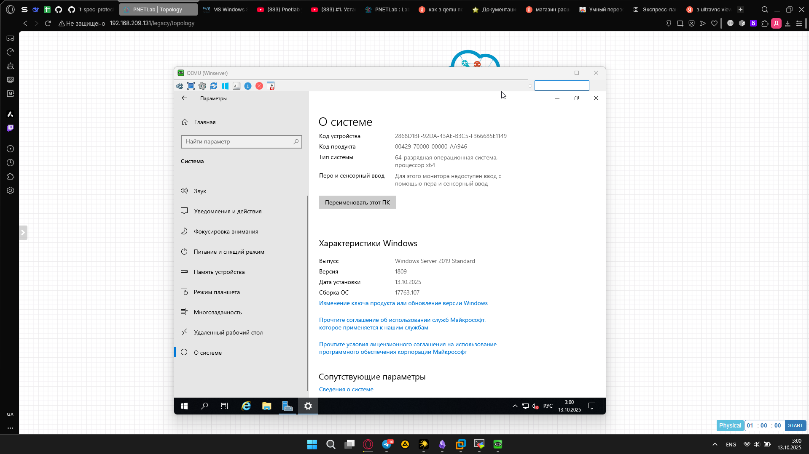
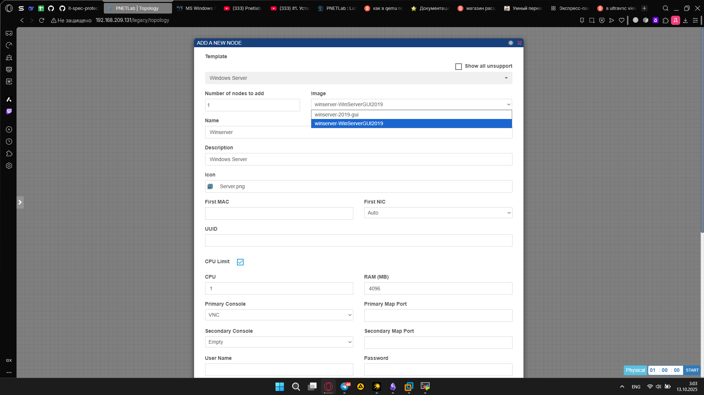
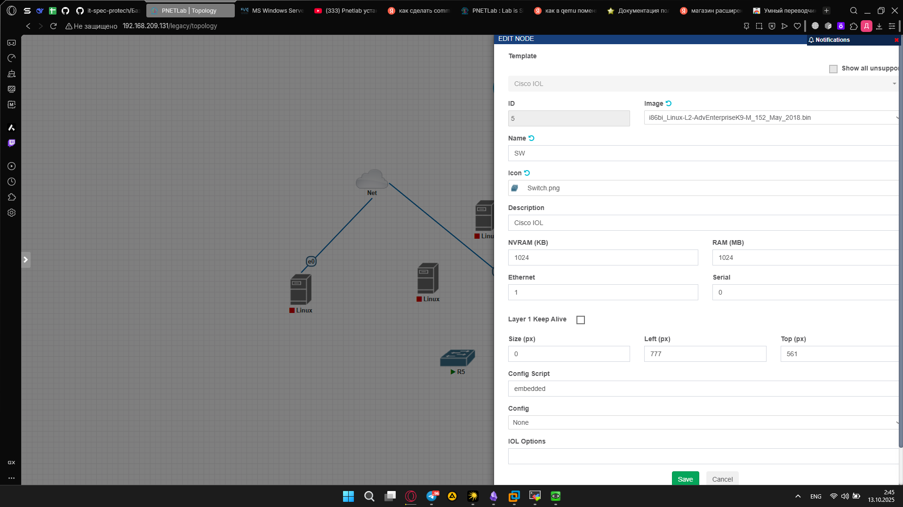
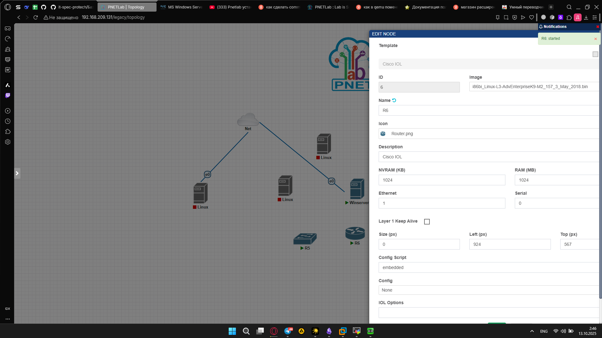

Скриншоты развернутого PNETLab и работающих IOL и QEMU нод:

Рисунок 1 - Работающий PNETLab

Рисунок 2 - Снапшоты Дебиана с графической оболочкой и без:

Рисунок 3 - Сами виртуалки с дебианом в двух версиях

Рисунок 4 - Windows Server 2019

Рисунок 4 - Снапшот Windows Server 

Рисунок 5 - IOL L2

Рисунок 6 - IOL L3

