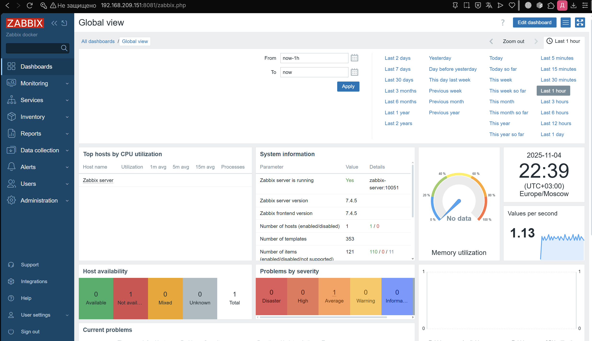
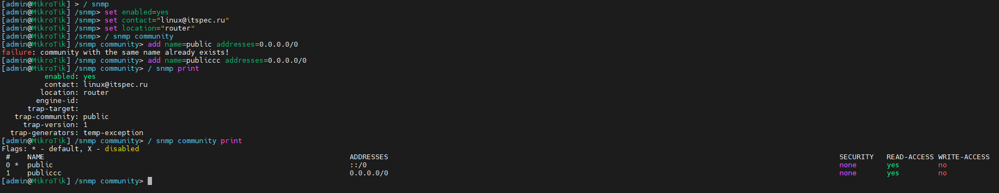
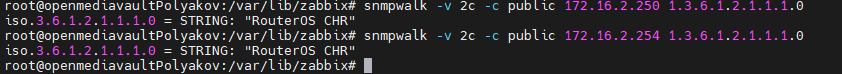
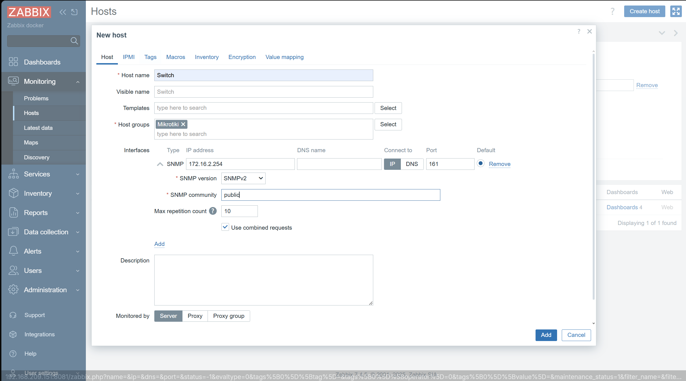
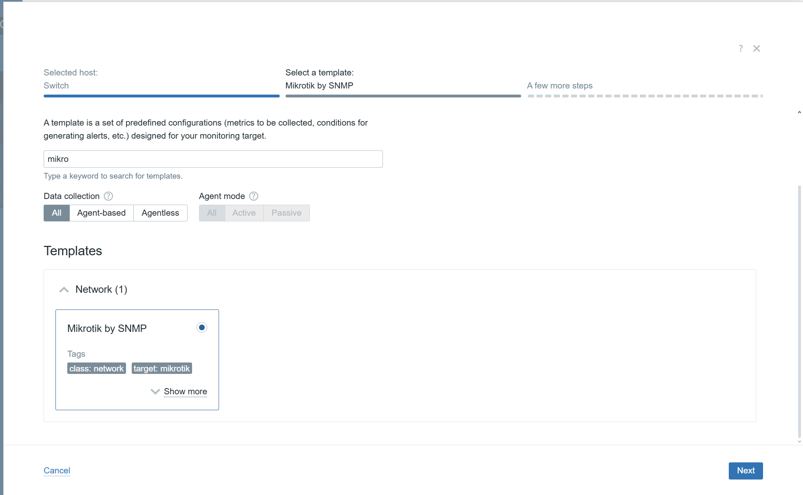
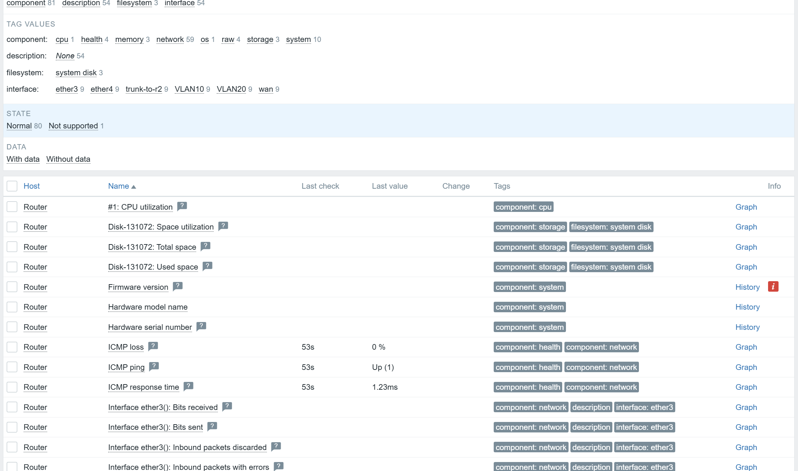
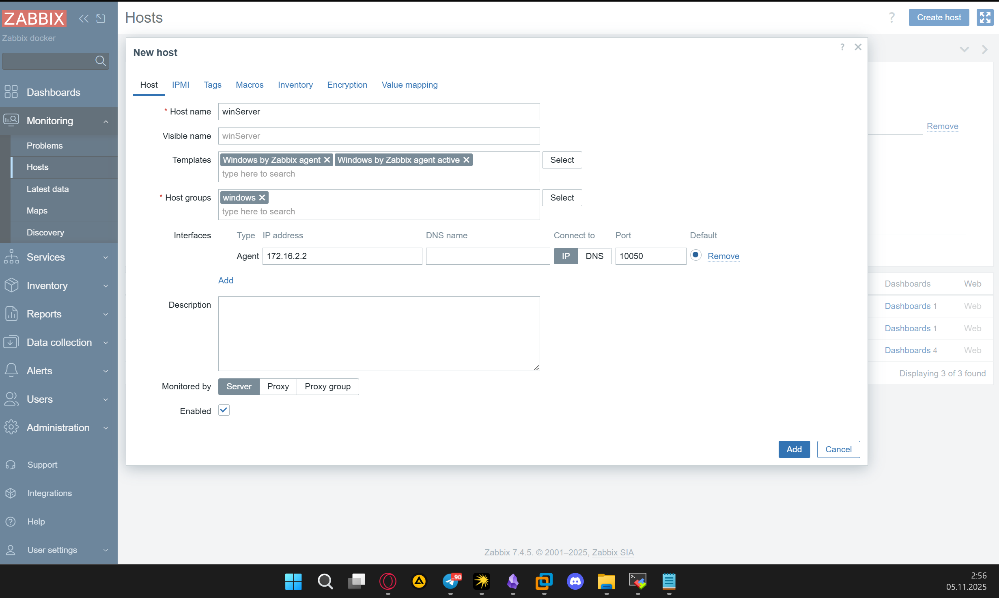
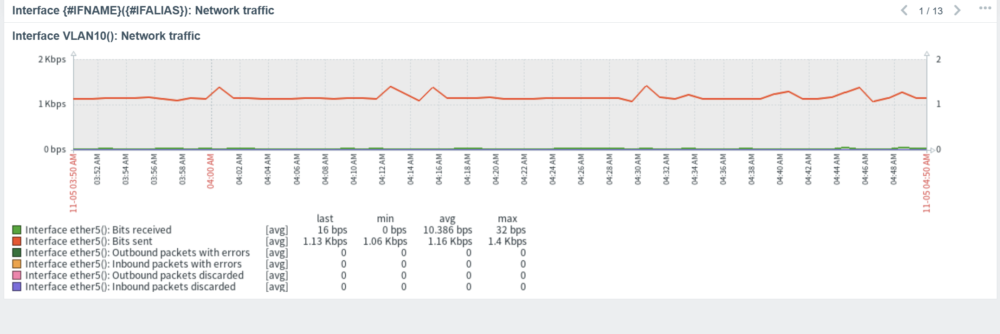
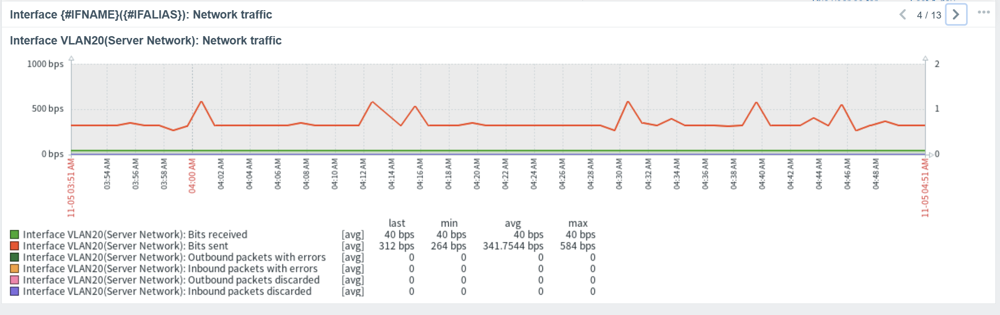

1. С помощью докера установил zabbix

2. Поменял настройки коммутатора и роутера

3. Проверил их 

4. Создал хосты для сетевых устройств, перед этим создав группы

5. Посмотрел их данные

6. Далее перешел к установке Zabbix agent на windows server, также добавил пользователя в хосты самого заббикса, проверил связность

7. Список всех хостов и дашборды 

