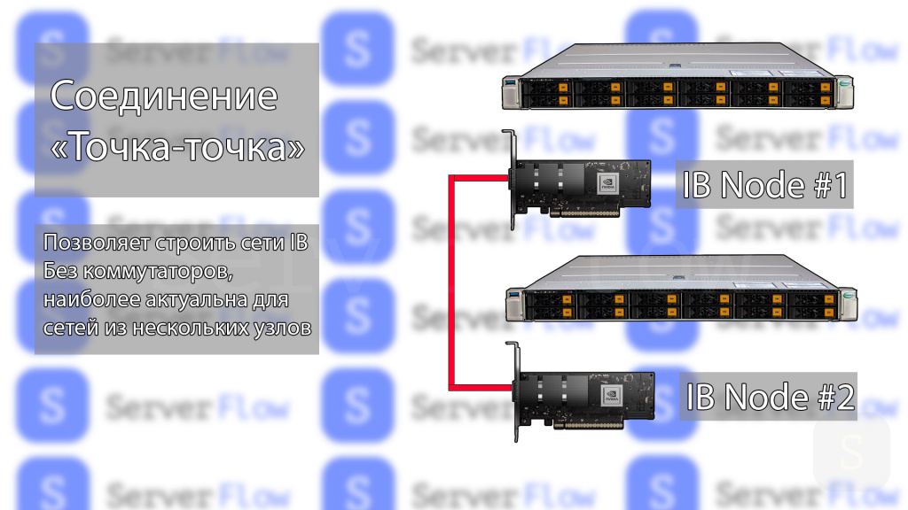
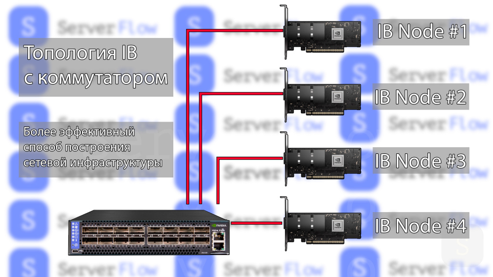
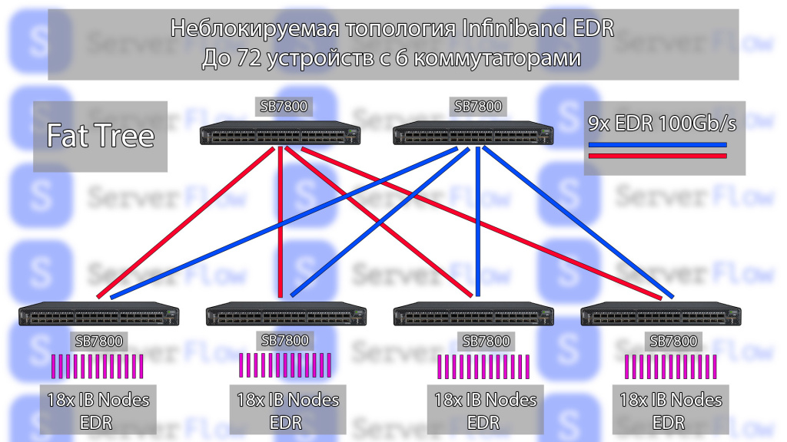
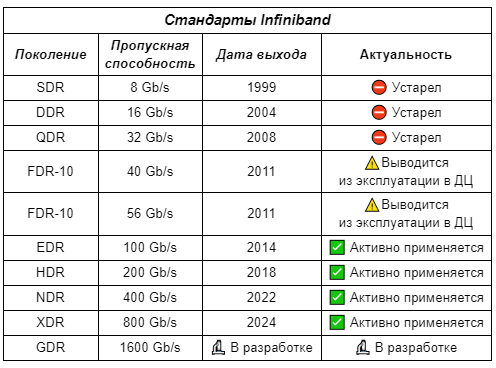
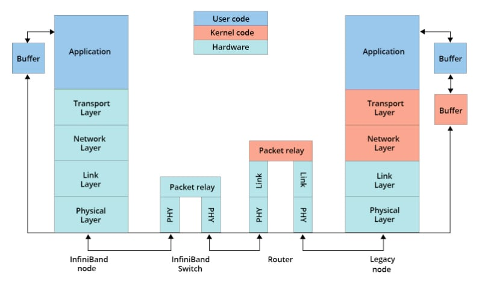

InfiniBand (IB) — это высокоскоростная коммутируемая сетевая технология с крайне низкой задержкой (low latency) и высокой пропускной способностью, созданная для суперкомпьютеров, ЦОД и ИИ-кластеров. Она обеспечивает прямую передачу данных между памятью устройств (RDMA), исключая потери пакетов и обгоняя Ethernet в задачах, требующих синхронной работы тысяч GPU/CPU. 

1. Узлы (Node) — это конечные точки, такие как серверы, системы хранения данных или рабочие станции, которые подключаются к InfiniBand сети через адаптеры каналов узлов (Channel Adapters).
2. Адаптеры каналов узлов (Channel Adapters, Host Channel) — это сетевые адаптеры InfiniBand, которые устанавливаются в узлы и обеспечивают их подключение к InfiniBand сети. Именно они реализуют технологию RDMA.
3. Коммутаторы (Switches)  — коммутаторы InfiniBand выполняют маршрутизацию пакетов данных между узлами и формируют топологию сети. Существуют как аппаратные, так и программные коммутаторы, однако Infiniband может существовать и без них, передавая данные напрямую по выделенному каналу между устройствами.
4. Каналы связи (Links) — каналы InfiniBand соединяют адаптеры узлов с коммутаторами и коммутаторы между собой. Они используют медные или оптоволоконные кабели для физического подключения.

InfiniBand использует архитектуру Fat Tree, когда коммутаторы выполняют большую часть работы по маршрутизации и коммутации трафика, разгружая узлы за счет структуры подключения, напоминающей дерево (увеличивается количество каналов связи при движении от листьев к корню).
Такая архитектура обеспечивает высокую пропускную способность, масштабируемость, качество обслуживания и отказоустойчивость InfiniBand сетей для высокопроизводительных кластеров и ЦОД.

Одним из главных конкурентов IB на рынке является Ethernet. Однако шины IB имеют ряд преимуществ:  

1. Меньшая задержка: латентность IB составляет около 1 микросекунды, что намного меньше задержки Ethernet в 10-50 микросекунд для малых пакетов данных.
2. Более эффективное использование процессора: IB использует технологию удаленного прямого доступа к памяти (RDMA), которая позволяет передавать данные напрямую между памятью узлов, минуя процессор и операционную систему — это снижает нагрузку на ЦП. Кроме того, Infiniband активно использует технологию Offloading, освобождающую процессор от лишних задач. В отличие от этого, в сетях Ethernet вся обработка данных ложится на процессор, что может привести к его перегрузке при обработке больших объемов данных.
3. Более высокая масштабируемость: InfiniBand позволяет строить масштабируемые кластеры с тысячами узлов, в то время как масштабируемость Ethernet в кластеризации ограничена и низкоэффективна, так как он не создавался для решения подобных задач.
4. Качество обслуживания (QoS): IB предоставляет функции гарантированного качества обслуживания и разделения трафика, чего нет в стандартном Ethernet.
5. Отказоустойчивость: InfiniBand имеет встроенные механизмы переключения каналов связи на резервный в случае, если с основным каналом возникли неполадки, что  обеспечивает более высокую отказоустойчивость, чем Ethernet.
  
Но у IB есть и недостатки —  более высокая стоимость компонентов инфраструктры, сложность настройки и то, что это проприетарная технология, которая является частной собственностью правообладателей и не удовлетворяет критерии свободного ПО. Также технология InfiniBand не может быть использована для доставки данных из глобальной сети Интернет, на ее основе нельзя построить всемирную сеть — IB обычно применяется в рамках ЦОД. В свою очередь, Ethernet разрабатывали как глобальную сеть, которая легко масштабируется для доставки данных с помощью пользовательских протоколов (HTTP или др.). Поэтому в обычных офисных сетях Ethernet остается превалирующей технологией.  
Стоит отметить, что стандарт Infiniband не задумывался как заменитель Ethernet, изначально он планировался в качестве высокоскоростного интерконнекта для передачи данных в высокопроизводительных средах, причем набор этих данных в большей степени отличен от Ethernet пакетов.

|Параметр|InfiniBand|High-Speed Ethernet (с RoCE)|
|---|---|---|
|**Основная технология**|Нативная аппаратная поддержка RDMA|RDMA поверх сети Ethernet (RoCE)|
|**Задержка (Latency)**|Сверхнизкая (от 90 наносекунд до ~1 мкс)|Низкая, но выше (обычно 2–10 мкс)|
|**Пропускная способность**|До 400 Гбит/с (NDR), в разработке 800/1600 Гбит/с|До 400 Гбит/с, в разработке 800/1600 Гбит/с|
|**Топология**|Коммутируемая ткань (Switched Fabric), Fat Tree|Spine-leaf, более универсальные топологии|
|**Управление перегрузками**|Встроенные аппаратные механизмы, сеть без потерь|Зависит от протоколов, требует сложной настройки (PFC)|
|**Основная область применения**|HPC, AI-кластеры, задачи с критической задержкой|Универсальные ЦОД, облака, корпоративные сети|
|**Стоимость развертывания**|Высокая (специализированное оборудование)|Ниже (более массовый рынок и стандарты)|
|**Поддержка RDMA**|Полная, нативная, максимальная эффективность|Через RoCE, производительность зависит от реализации|

### Пять уровней архитектуры InfiniBand

1. **Физический уровень.** Определяет типы [кабелей](https://kvan.tech/catalog/komplektuyushchie/kabeli/ "кабели") (медь, оптика), разъемы, скорости передачи сигналов и электрические характеристики.
2. **Канальный уровень.** Отвечает за формирование пакетов данных, управление потоком и создание виртуальных каналов для разделения трафика. Именно здесь работает механизм, гарантирующий доставку без потерь.
3. **Сетевой уровень.** Обеспечивает маршрутизацию пакетов внутри одной подсети InfiniBand (Subnet) с помощью [коммутаторов](https://kvan.tech/catalog/setevoe-oborudovanie-i-organizatsiya-setey/kommutatory/ "коммутаторы") и [маршрутизаторов](https://kvan.tech/catalog/setevoe-oborudovanie-i-organizatsiya-setey/marshrutizatory/ "маршрутизаторы") InfiniBand, используя локальные идентификаторы (LID).
4. **Транспортный уровень.** Гарантирует сквозную доставку данных между приложениями на разных узлах. Он управляет очередями и реализует механизмы RDMA.
5. **Верхний уровень (Upper-Layer Protocols).** Набор протоколов, которые позволяют стандартным приложениям работать поверх InfiniBand. Сюда входят IPoIB (IP-over-InfiniBand), SDP (Sockets Direct Protocol) и другие.
https://serverflow.ru/blog/stati/chto-takoe-infiniband-istoriya-sozdaniya-i-kak-on-rabotaet/