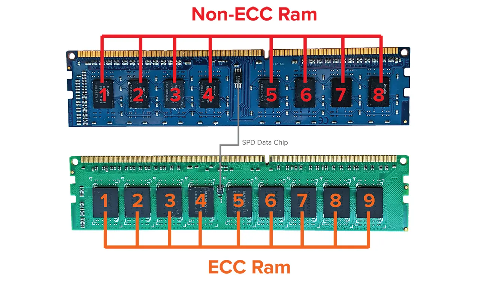

Современные серверные платформы предъявляют высокие требования к стабильности работы, поскольку сбои в памяти могут привести к потере данных, нарушению работы приложений и снижению производительности всей системы. Одной из ключевых технологий, обеспечивающих надежность серверных решений, является механизм исправления ошибок (Error Correction Code, ECC).

### Почему серверная память требует исправления ошибок

Оперативная память является важным компонентом серверных решений. В отличие от обычных компьютеров, серверные системы работают в режиме 24/7, обрабатывая огромные объемы данных. Любая ошибка, возникшая в памяти, может привести к некорректному выполнению программ, повреждению файлов или полной потере информации.

Ошибки в памяти могут быть вызваны различными факторами:
- **Электромагнитное излучение** – космические лучи и радиация могут вызывать сбои в битах памяти.
- **Перегрев модулей** – высокие температуры в серверных стойках увеличивают вероятность случайных ошибок.
- **Программные сбои** – некорректная работа программного обеспечения может провоцировать нарушения целостности данных.
- **Аппаратные дефекты** – деградация компонентов оперативной памяти со временем приводит к появлению неисправностей.

#### Виды ошибок в серверной памяти

|Тип ошибки|Описание|Возможные последствия|
|---|---|---|
|**Одиночная битовая ошибка (SEC — Single Error Correction)**|Изменение одного бита данных|Может быть автоматически исправлена при использовании ECC-памяти|
|**Многобитовая ошибка (DEC — Double Error Detection)**|Изменение двух или более битов|Может быть обнаружена, но не всегда исправлена|
|**Неисправимые ошибки (UE — Unrecoverable Errors)**|Ошибки, которые нельзя исправить средствами памяти|Сбои в работе сервера, потеря данных, повреждение файлов|
Использование механизмов коррекции ошибок позволяет снизить вероятность возникновения критических неисправностей и минимизировать риски сбоя системы.
#### Как работает исправление ошибок в серверной памяти

Серверная память с функцией коррекции ошибок содержит дополнительные биты данных, используемые для контроля и исправления информации.

Основные технологии исправления ошибок:

- **ECC (Error Correction Code)** – исправляет одиночные битовые ошибки и обнаруживает многобитовые.
- **Chipkill** – расширенная технология коррекции, способная исправлять ошибки сразу в нескольких битах.
- **Patrol Scrubbing** – автоматическое сканирование памяти в фоновом режиме для выявления и исправления потенциальных ошибок.
- **Memory Mirroring** – зеркалирование данных на два модуля памяти для повышения надежности.

#### Разновидности серверной памяти с исправлением ошибок

|Тип памяти|Возможности|Область применения|
|---|---|---|
|**UDIMM ECC**|Коррекция одиночных ошибок, обнаружение многобитовых|Рабочие станции, малые серверы|
|**RDIMM ECC**|Буферизированная память, снижает нагрузку на контроллер|Средние и крупные серверы|
|**LRDIMM ECC**|Позволяет устанавливать модули высокой емкости|Высоконагруженные серверы, ЦОД|
|**FB-DIMM ECC**|Полностью буферизированная память|Устаревшие серверные платформы|

Каждый тип серверной памяти выбирается в зависимости от конфигурации оборудования и требований к надежности.

#### Сравнение памяти с ECC и без

|Характеристика|Обычная память|ECC-память|
|---|---|---|
|Исправление ошибок|Нет|Да|
|Надежность данных|Средняя|Высокая|
|Производительность|Выше|Чуть ниже (из-за проверки данных)|
|Область применения|Домашние ПК, игровые компьютеры|Серверы, рабочие станции, базы данных|

Хотя память с исправлением ошибок может незначительно уступать по скорости стандартной RAM, ее использование в серверных решениях оправдано минимизацией риска сбоев и потери данных.

#### Какие процессоры поддерживают ECC-память

Не все серверные и настольные платформы поддерживают использование памяти с исправлением ошибок.

|Производитель|Серии процессоров с поддержкой ECC|
|---|---|
|Intel|Xeon, некоторые модели Core i5/i7/i9|
|AMD|EPYC, Ryzen PRO, Threadripper PRO|

Перед покупкой серверной оперативной памяти необходимо убедиться в ее совместимости с материнской платой и процессором.

Исправление ошибок в серверной оперативной памяти – это критически важная технология, обеспечивающая стабильность и защиту данных в профессиональных вычислительных системах. Использование памяти с ECC снижает вероятность сбоев, предотвращает повреждение файлов и увеличивает срок службы оборудования. Серверные платформы, научные вычисления, базы данных и облачные решения требуют применения таких технологий для гарантированной надежности и минимизации рисков потери информации.