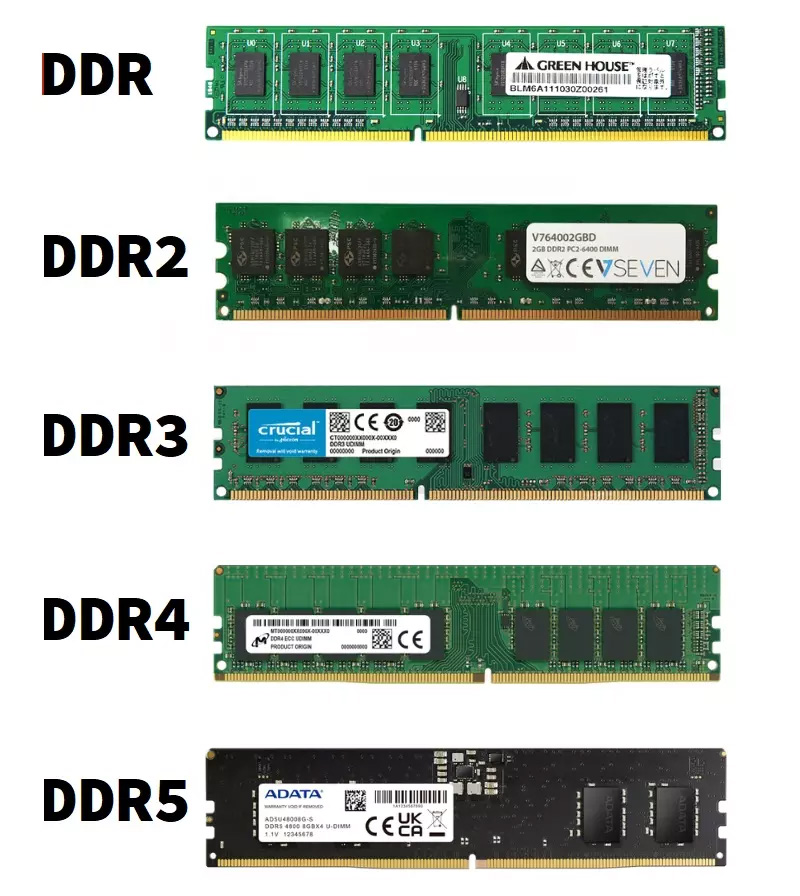

Современные компьютеры используют разные типы оперативной памяти, которые отличаются скоростью работы, энергопотреблением и объёмом.

|Поколение|Год выхода|Эффективная частота (max), МГц|Количества данных за такт, бит|Пропускная способность (max), ГБ/с|
|---|---|---|---|---|
|SDRAM|1996|133|1|1|
|DDR|2000|700|2|5.6|
|DDR2|2003|1200|4|9.6|
|DDR3|2007|2933|8|23.4|
|DDR4|2014|5000|8|40|
|DDR5|2021|пока 8000|16|пока 65.6|

Каждое новое поколение оперативной памяти обеспечивает более высокую частоту и пропускную способность, снижая энергопотребление и повышая эффективность работы системы.

## История
Прототип нового вида памяти DDR создала компания Samsung в 1997 году, а полноценный рабочий чип был представлен в 1998-м. Но выход комплектующих в массы произошел спустя 2 года, когда дебютировали материнские платы с поддержкой DDR.
Данная разновидность ОЗУ базировалась на SDRAM, но создатели изменили механику считывания команд. Главное новшество отчасти становится понятным из расшифровки названия — Double Data Rate: здесь имеет место удвоение скорости передачи, поскольку данные «берутся» дважды за такт. Эту технологию еще называют 2n-prefetch.

Интересно, что физическая частота работы памяти на фоне SDRAM не изменилась, но количество передаваемых данных выросло в 2 раза. В связи с этим появилось понятие эффективных МГц. Так, у DDR именно соответствующий параметр стал главной характеристикой. Реальные 133 МГц (как и у предшественницы SDRAM) обеспечили эффективные 266 МГц у DDR.

Вкратце об основных рабочих характеристиках DDR:
- реальная (физическая) частота упоминаться перестала;
- эффективная частота составила от 266 до 700 МГц (но чаще всего до 400 МГц);
- типичное напряжение 2.5 В;
- быстродействие 3.2 ГБ/с (и до 5.6 ГБ/с при разгоне) на один канал;
- поддержка двухканального режима, то есть пропускная способность с двумя планками повышается

В 2003 году дебютирует DDR2. Во втором поколении реализовали возможность передачи 4 бит за такт (технология 4n-prefetch). Добиться этого удалось за счет повышения частотных характеристик шины и буфера.

Разберем на конкретном примере. В микросхеме DDR1 при физической частоте 200 МГц все компоненты работают на таких показателях. Эффективные частотные характеристики достигают 400 МГц (за счет 2n-prefetch). В DDR2 с теми же 200 МГц шина и буфер функционируют на удвоенной частоте 400 МГц, так что итоговое эффективное значение для модуля — 800 МГц.

В результате кратно выросло быстродействие, но аналогичным образом повысились и задержки (возросли тайминги выполнения операций), поэтому сперва DDR2 не давала ощутимого прироста производительности. Ситуация изменилась с выпуском новых поколений процессоров — AMD Athlon X2 и Intel Core 2. Кстати, и сегодня в полной мере раскрывать потенциал передовых стандартов ОЗУ позволяют адаптированные под них «движки» (и выходят они обычно с опозданием).

Главные параметры DDR2:

- частоты до 1200 МГц;
- рабочее напряжение от 1.8 до 2.1 В;
- ПС до 9.6 ГБ/с.

В 2007 году выходит DDR3. Прирост эффективной частоты тут был реализован аналогичным образом — данные стали передаваться 8 раз за такт (8n-prefetch). Обеспечили это за счет еще одного удвоения частотных значений шины и буфера памяти, а ядро, как и ранее, работало в диапазоне реальных показателей от 100 до 266 МГц. Изначально проблемы у DDR3 были теми же — большие тайминги и, как следствие, незначительный прирост производительности. Ситуацию скорректировали новые «движки» Intel на платформе LGA1366, где появился 3-канальный контроллер памяти.

Еще одним новшеством третьего поколения ОЗУ стала функция Extreme Memory Profile (XMP), обеспечивающая поддержку разгона частотных характеристик.

Основные отличия DDR3:

- частота до 1866 МГц, а с XMP — до 2933 МГц;
- типичное напряжение 1.5 В;
- быстродействие до 23.4 ГБ/с на канал.

В 2014 году на рынок выходит четвертое поколение ОЗУ — DDR4. Инженеры решили отойти от практики дальнейшего повышения частоты шины, а оптимизировали доступ к данным: информация берется не из одного, а из двух банков памяти, а потом объединяется в один поток. По сути тут идет речь про 8n-prefetch, но с увеличенными частотами (правда, уже не 2-кратно) и меньшим рабочим напряжением.
Основные характеристики четвертого поколения DDR:
- частоты — до 3200 МГц (и до 5000 МГц с разгоном XMP);
- рабочее напряжение 1.2 В (с разгоном — выше);
- ПС до 40 ГБ/с.
Отметим, что с повышением многоядерности процессоров прирост пропускной способности ОЗУ в пересчете на ядро практически отсутствовал. А многие контроллеры памяти актуальных сегодня «движков» оказались не готовы к пиковым частотным характеристикам DDR4, что вылилось в появление делителей, которые позволяют процессору работать с половинной частотой планки.

Казалось бы, развитие «движков» явно не поспевает за технологиями ОЗУ и только начинают раскрывать весь потенциал четвертого поколения, но в 2021 году дебютирует DDR5. Тут имеют место сразу несколько значимых изменений:
- Это ОЗУ способно передавать данные не 8, а 16 раз за такт (16n-prefetch).
- Вместо стандартной 64-битной шины используется пара каналов по 32 бит, что обеспечивает возможность параллельного выполнения большего числа задач.
- Достигнут прирост объема памяти на одну планку вплоть до 128 ГБ, тогда как у DDR4 максимум — 32 ГБ.
- На каждом модуле по умолчанию реализована коррекция ошибок (ECC), которая в ранних поколениях имела место только в серверной «оперативке».

Основные характеристики пятого поколения DDR5:
- частоты стартуют от 4800 МГц;
- типичное напряжение 1.1 В;
- быстродействие на один канал до 65.6 ГБ/с.