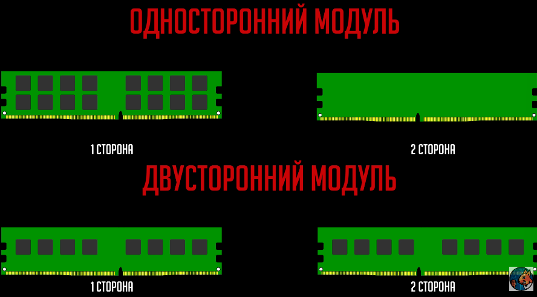

Ранг (rank) — область памяти из нескольких чипов памяти в 64 бита (72 бита при наличии ECC)

Увеличение количества рангов можно охарактеризовать следующим образом:

- больше скорость;
- конструкция сложнее и дороже;
- в меньшей степени подвержена разгону;
- требуется соответствующая материнская память и процессор.

Поэтому для создания мощной машины следует использовать планки с большим количеством рангов.

| Параметр                         | Одноранговая (1R)                                                    | Двухранговая (2R)                                                                    |
| -------------------------------- | -------------------------------------------------------------------- | ------------------------------------------------------------------------------------ |
| **Производительность**           | Стандартная. Лучший потенциал для экстремального разгона по частоте. | Выше на 5–10% при одинаковой частоте за счёт чередования рангов (Rank Interleaving). |
| **Совместимость при смешивании** | Менее чувствительна к смешиванию, но всё-таки не рекомендуется.      | Возможна потеря скорости, повышение таймингов или отказ от двухканального режима.    |
| **Типичное применение**          | Модули до 16 ГБ, сборки с фокусом на разгон по частоте.              | Модули от 16 ГБ, производительные ПК, системы с интегрированной графикой.            |
### Возможные проблемы и правила установки смешанных модулей

Неправильная установка модулей с разным числом рангов приводит к неприятным последствиям.
- **Снижение частоты.** Чтобы обеспечить стабильность, материнская плата может автоматически снизить рабочую частоту и повысить тайминги (задержки) для всех модулей до уровня, который гарантированно поддерживается смешанной конфигурацией.
- **Потеря двухканального режима.** Двухканальный режим удваивает пропускную способность шины памяти. При неверной установке модулей, когда в одном канале оказываются планки 1R и 2R, система переключится в медленный одноканальный режим.
- **Правило установки.** Чтобы сохранить двухканальный режим, модули одного типа (два двухранговых) рекомендуется устанавливать в слоты одного цвета (A2 и B2), а модули другого типа — в слоты другого цвета (A1 и B1). Всегда сверяйтесь с инструкцией к вашей материнской плате, так как топология слотов отличается.