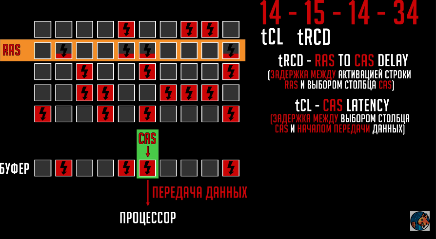
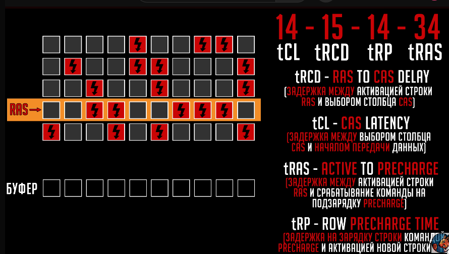
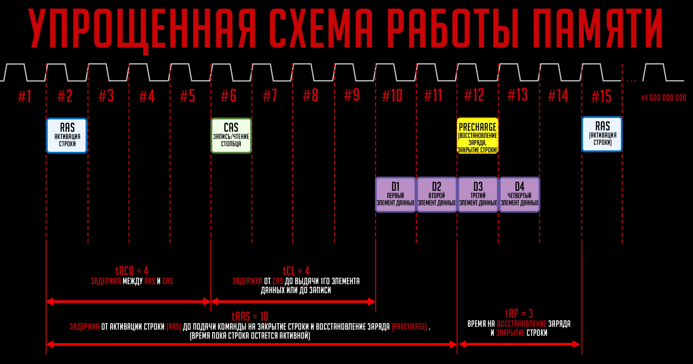

Тайминги оперативной памяти определяют задержку между запросом к модулю оперативной памяти и моментом, когда данные становятся доступными для процессора. CAS Latency (CL) — один из ключевых параметров, который указывает количество тактов, необходимых для выполнения этой операции. Чем ниже значение CAS Latency, тем быстрее память передаёт данные, что напрямую влияет на общую производительность системы.
Задержка CAS (задержка адреса столбца) обозначает количество тактов памяти, необходимых для обработки запроса и начала передачи данных. Например, в обозначении **CL16-18-18-36** первая цифра (16) обозначает задержку CAS, а остальные параметры относятся к другим задержкам, связанным с работой памяти.

**Основные тайминги оперативной памяти:**

1. **CL (задержка CAS)** — задержка между командой и доступностью данных.
2. **tRCD (задержка перехода от адреса строки к адресу столбца)** — время между выбором строки и выбором столбца.
3. **tRP (время предварительной зарядки строки)** — время, необходимое для закрытия одной строки и открытия другой.
4. **tRAS (время активной работы строки)** — минимальное время, в течение которого строка должна оставаться активной.

Тайминги - задержки между осуществлением операций(14-16-17-34 или CL14(первый тайминг)), измеряются в тактах
Модуль памяти состоит из чипов памяти, а они сами по себе ячеисты.

За счет подъема напряжения можно уменьшать тайминги - это называется масштабируемостью. Масштабируются только tCL, tRP, все остальные еще.

Тайминги и частоты зависят от качества печатной платы, чипы памяти, ранговости, мат.плата(под-ка разгона, qvl лист совместимости, кол-во каналов памяти, топология платы), контроллер памяти процессора.

Задержки памяти определяют, насколько быстро оперативная память взаимодействует с процессором. При одинаковой частоте модуль с **меньшим CL** будет быстрее передавать данные, что важно для геймеров, разработчиков, инженеров и пользователей, работающих с ресурсоёмкими приложениями.

**Пример влияния таймингов на производительность:** 

|Частота (MHz)|Задержка CAS (CL)|Эффективная задержка (нс)|
|---|---|---|
|2666 МГц|CL16|12,00 нс|
|3200 МГц|CL18|11,25 нс|
|3600 МГц|CL16|8,89 нс|
|4000 МГц|CL19|9,50 нс|
Чем выше частота и ниже задержка CAS, тем быстрее память выполняет операции. Однако при выборе следует учитывать баланс между тактовой частотой и таймингами.

