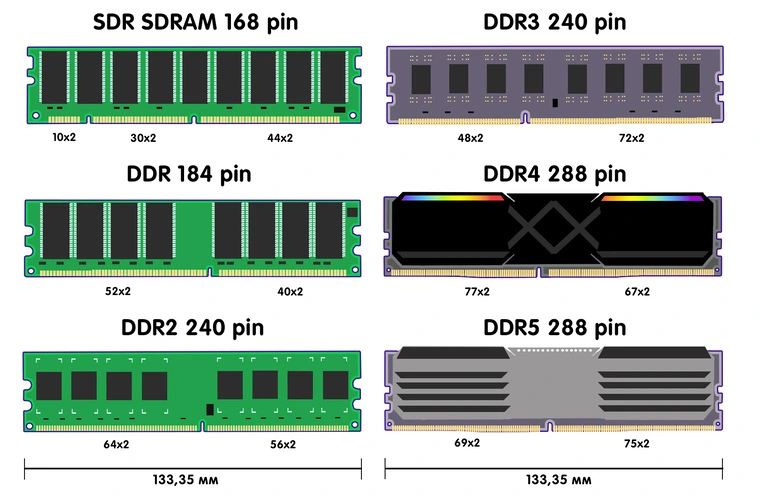
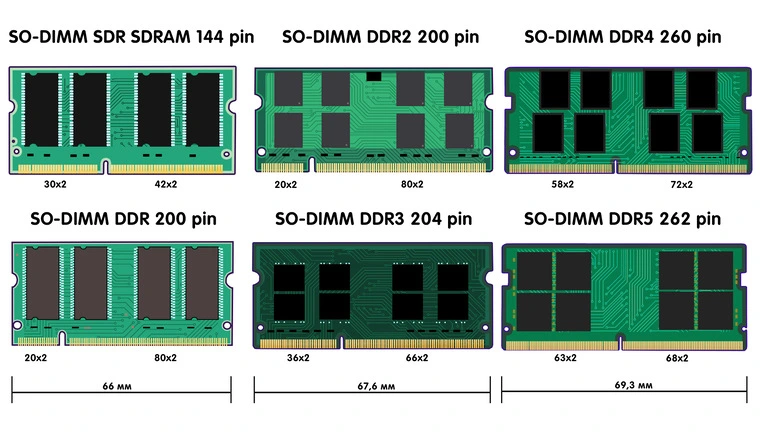
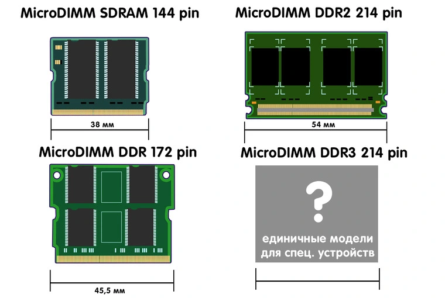
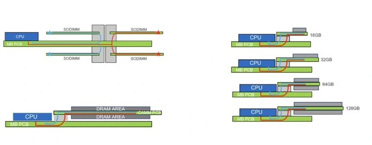
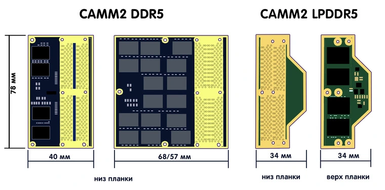

### Форм-факторы
**Single in-line memory module** (SIMM) — устаревший форм-фактор оперативной памяти, использовавшийся в компьютерах, принтерах и некоторых ноутбуках в 90-е годы. Стандарт был разработан в 1983 году компанией Wang Laboratories. В планках SIMM контакты, расположенные на разных сторонах модуля, замкнуты между собой и передают одни и те же сигналы. Использовались чипы асинхронной памяти FPM (Fast Page Mode) и улучшенные вариант EDO (Extended Data Out). Последний обеспечил прибавку к быстродействию на уровне 30 %.

Первые модели выполнялись в виде планок 30-pin объемом до 16 МБ. После появились усовершенствованные модели 72-pin объемом до 64 МБ. В них же для разделения контактов появился ключ — специальная выемка в нижней части.

Dual In-line Memory Module (DIMM) — современный стандарт форм-фактора оперативной памяти, который стал развитием предыдущего. Ключевое отличие от SIMM — контакты, расположенные на разных сторонах модуля, являются независимыми — то есть передают каждый свой сигнал. Практически все модули DIMM имеют стандартную длину 133,35 мм. Отличаются они числом контактов и расположением ключа.

С точки зрения габаритов также существуют **Very Low Profile (VLP DIMM)** и **Ultra Low Profile (ULP DIMM)** высотой до 18,75 и 17 мм соответственно.

В категорию планок DIMM входят подгруппы, разделяющиеся уже по конструктивному исполнению:

- **UDIMM** (Unbuffered DIMM) — небуферезированная память (DDR-DDR5);
- **CUDIMM** (Clocked Unbuffered Dual In-Line Memory Module) — небуферезированная память с генератором тактовой частоты (DDR5);
- **RDIMM** (Registered DIMM) — регистровая память (DDR-DDR5);
- **LRDIMM** (Load-Reduced DIMM) — с уменьшенной нагрузкой (DDR3-DDR5);
- **MRDIMM** (Multiplexed Rank DIMM) — память с мультиплексированием (DDR5).

С точки зрения форм-фактора и контактов они идентичны в рамках одного поколения. Разница кроется в «начинке», дополнительных чипах и принципе работы с данными. Например, у RDIMM есть отдельная схема регистра, за счет которой увеличивается стабильность работы на больших нагрузках. Последние три группы используются преимущественно в серверном сегменте.

**Small Outline Dual In-line Memory Module** (SO-DIMM) — уменьшенный форм-фактор оперативной памяти, созданный для компактной техники. Стандарт был представлен в 1997 году и повсеместно используется в ноутбуках, сетевых и некоторых других устройствах. Планки этого форм-фактора имеют длину от 66 до 69,3 мм в зависимости от поколения.

## Mini-DIMM

Этот форм-фактор появился как промежуточное поколение между DIMM и SO-DIMM. Такие планки ОЗУ нередко применяются в маршрутизаторах, коммутаторах, а также во встраиваемых системах и промышленном оборудовании.

В связи со специфическим применением разнообразие модулей не так велико, а их длина варьируется, но в среднем составляет 80–82 мм. Например, в формате Mini-DIMM DDR3 выпускались платы флеш-памяти для RAID-контроллеров HP.

## Micro-DIMM

Устаревший форм-фактор оперативной памяти, использовался в ультракомпактных устройствах, преимущественно субноутбуках от компаний Sony, Fujitsu и некоторых других. Габариты варьировались в зависимости от поколения.

## CAMM2

В 2022 году компания Dell в своих рабочих станциях линейки Precision представила новый форм-фактор и способ установки оперативной памяти — **Compression Attached Memory Module** (CAMM). Новинка была спроектирована в качестве замены SO-DIMM. Планки ОЗУ также располагаются параллельно материнской плате, но фиксируются сверху винтами, а сигналы передаются через LGA‑контактную площадку.

Такой подход, по словам инженеров, позволил сэкономить пространство, а в перспективе и увеличить предельные характеристики за счет другой компоновки.

Общее количество контактов CAMM составляет 616 —14 рядов по 44 контакта. Размер модуля — 98 × 68 мм. В рабочих станциях могли устанавливаться планки CAMM объемом от 16 до 128 ГБ.

