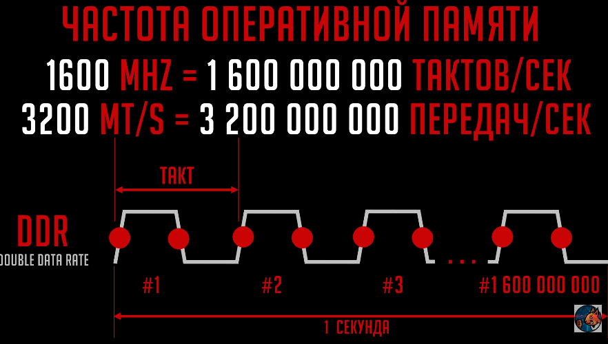

Частота оперативной памяти измеряется в мегагерцах (МГц) и указывает на количество тактов в секунду. Чем выше этот показатель, тем быстрее передаются данные между памятью и процессором. Однако реальная производительность зависит от архитектуры системы, возможностей контроллера памяти и оптимизации таймингов.
### Разгон памяти и XMP
XMP (Extreme Memory Profile) — технология автоматического разгона, позволяющая использовать заводские профили разгона памяти. С ее помощью можно активировать модули с частотой 3200 МГц и выше, повышая производительность системы.

За счет подъема напряжения можно уменьшать тайминги - это называется масштабируемостью. Масштабируются только tCL, tRP, все остальные еще.

Тайминги и частоты зависят от качества печатной платы, чипы памяти, ранговости, мат.плата(под-ка разгона, qvl лист совместимости, кол-во каналов памяти, топология платы), контроллер памяти процессора.