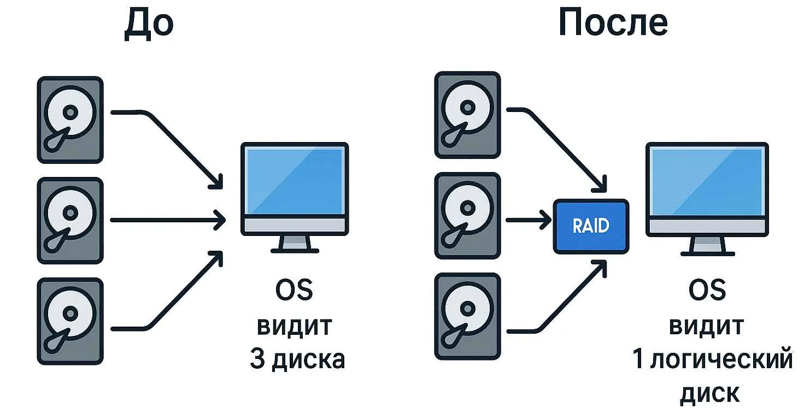

**Программные**. Вся нагрузка по управлению массивом ложится на центральный процессор. Наименее производительное и отказоустойчивое решение.
**Интегрированные**. Встроены в материнскую плату. Отдельный чип выполняет часть задач по управлению, но всё же тоже задействует центральный процессор. Интегрированные контроллеры могут иметь собственную кэш-память. По сравнению с программными, поддерживают больше видов массивов, работают куда быстрее и надёжнее.

Аппаратный RAID-контроллер – это специализированное устройство, занимающееся аппаратной реализацией технологии RAID (Redundant Array of Independent Disks). Эта технология позволяет объединить несколько жестких дисков в один массив, который обеспечивает улучшенную производительность, большую емкость и повышенный уровень защиты данных. С помощью аппаратных RAID-контроллеров происходит эффективная обработка информации, а также создание различных уровней RAID, таких как RAID 0, RAID 1, RAID 5, RAID 6 и другие.
#### Виды
- Внутренние. Нужны для подключения дисков, которые установлены непосредственно в сервер, к которому подключен контроллер.
- Внешние. Служат для взаимодействия с внешними хранилищами.
Имеют собственный процессор, многие имеют кэш-память для ускорения работы. В устройства подороже опционально устанавливаются батареи (Battery Backup Unit, сокр. BBU, химические, либо конденсаторные) для сохранения данных в кэше в случае аварийного отключения электропитания. 

Для подключения дисков контроллер может иметь внутренние, либо внешние порты, либо и те, и другие. Порты могут быть выполнены по различным стандартам(SAS, SFF-8639)

|Параметр|Аппаратный RAID|Программный RAID|Интегрированный RAID|
|---|---|---|---|
|**Производительность**|Высокая, не зависит от загрузки ЦП|Зависит от мощности ЦП, ниже аппаратного|Средняя, частично нагружает ЦП|
|**Надежность**|Высокая, защита кэша с BBU|Зависит от стабильности ОС|Выше программного, но ниже аппаратного|
|**Нагрузка на ЦП**|Нулевая или минимальная|Высокая, особенно на RAID 5/6|Частичная|
|**Стоимость**|Высокая|Нулевая (входит в ОС)|Низкая (входит в стоимость платы)|
|**Наличие кэша и BBU**|Да, стандарт для серверных моделей|Нет|Редко, в дорогих материнских платах|
|**Лучшее применение**|Критически важные серверы, СУБД, виртуализация|Домашние NAS, тестовые стенды, некритичные задачи|Серверы начального уровня, рабочие станции|

