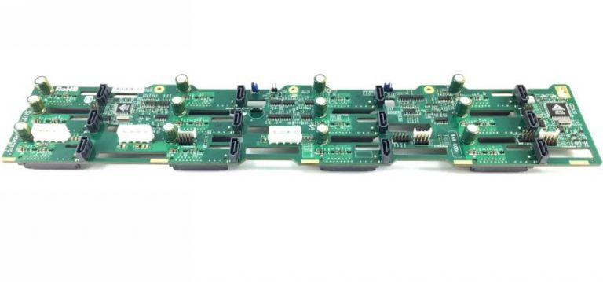
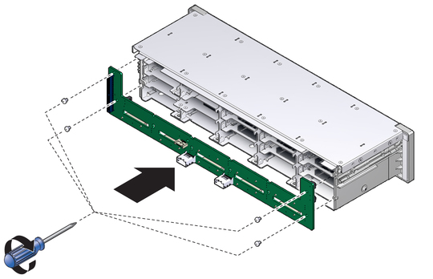
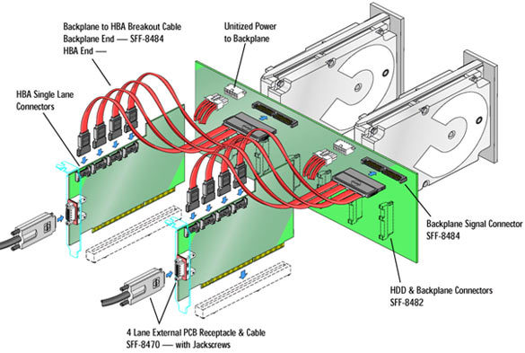
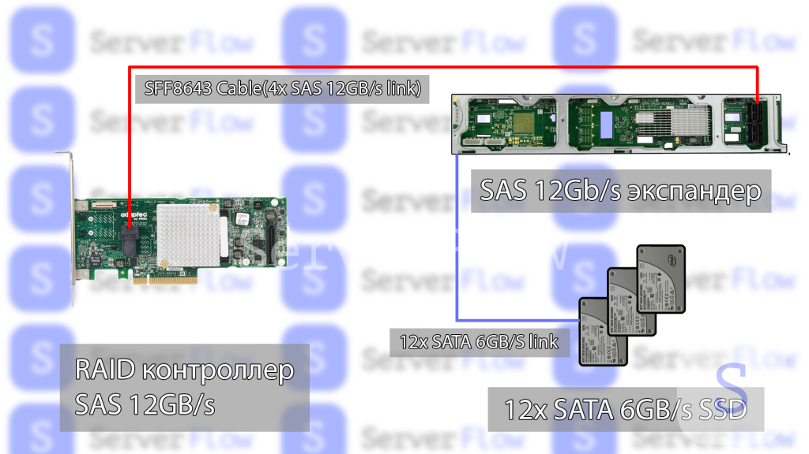

Бэкплейн (объединительная панель) в сервере — это специальная плата с разъемами, объединяющая компоненты (чаще всего диски) и соединяющая их с контроллером. Она обеспечивает Hot-Swap (горячую замену), индикацию активности, питание и передачу данных (SAS/SATA/NVMe), упрощая кабельную структуру и управление хранилищем.

**Бэкплейн** — это специализированная печатная плата с множеством разъёмов, которая служит **физическим интерфейсом и коммутатором** для подключения накопителей (HDD, SSD) внутри корпуса сервера, рабочей станции или дисковой полки (JBOD).

Его основная задача — **заменить собой паутину из отдельных кабелей "данные + питание" для каждого диска**, обеспечив аккуратное, надёжное и обслуживаемое соединение. 
##### **КАБЕЛИ НЕ НУЖНЫ!**

**Ключевая аналогия:** Бэкплейн — это как **этажный распределительный щиток в многоквартирном доме**. К нему подходят несколько магистральных кабелей (электроснабжение, интернет), а внутри он разводит подключение на множество отдельных квартир (дисков). Вы не тянете отдельный кабель от электростанции к каждой квартире.

Поддерживает горячую замену, замену накопителя без выкл сервера
Подключается к мат плате через SAS(SFF-8087), к SATA

## Как к Бэкплейну подключаются накопители?

1. **Физическое соединение:**
    
    - Накопители не подключаются кабелями. Они вставляются **напрямую** в разъёмы бэкплейна, расположенные на его лицевой или тыльной стороне.
    - Для этого используются специальные **салазки (caddies, trays)**, в которые предварительно устанавливается сам диск. Эти салазки имеют контактную площадку, точно совпадающую с разъёмом на бэкплейне.
    
2. **Типы разъёмов на стороне дисков:**
    
    - **SAS (Serial Attached SCSI):** Универсальный разъём. К нему можно подключить как **SAS-диски**, так и **SATA-диски**. Это стандарт для профессионального оборудования.
    - **SATA (Serial ATA):** Встречается в более дешёвых или устаревших системах. Такой разъём совместим **только с SATA-дисками**.
    - Разъём объединяет в себе **интерфейс передачи данных** и **контакты питания** (обычно +12V и +5V).
    
3. **Поддерживаемые протоколы (через одни и те же разъёмы):**
    
    - **SAS Protocol:** Для SAS-дисков. Поддерживает расширенные функции (двухпортовость для отказоустойчивости, расширенные команды управления).
    - **SATA Protocol:** Для SATA-дисков.
    - **NVMe over PCIe (в современных системах):** В новых бэкплейнах для U.2 NVMe SSD используются другие разъёмы (SFF-8639), которые передают уже не SAS/SATA, а сигналы PCI Express.

## Как Бэкплейн подключается к системе (материнской плате / контроллеру)?

Бэкплейн **не является активным управляющим устройством**. Поэтому он должен быть подключён к контроллеру, который будет управлять дисками. Подключение происходит через его **тыльную (обратную) сторону**.
### 1. Подключение к контроллеру (RAID или HBA)

Это основной и самый распространённый сценарий в серверах.
- **Разъёмы на бэкплейне:** Несколько портов **SFF-8643** (для внутреннего подключения, mini-SAS) или, в более старых системах, **SFF-8087** (mini-SAS).
- **Кабели:** Используются  кабели с соответствующими коннекторами (например, SFF-8643 to SFF-8643). Один такой кабель объединяет в себе **4 отдельные линии передачи данных (lanes)**
- **Схема:** Один кабель SFF-8643 может обслуживать 4 SATA/SAS-диска. Например, для 24-дискового бэкплейна потребуется 6 таких кабелей (24 / 4 = 6). Часто на бэкплейне есть два набора портов для обеспечения избыточности (подключения к двум разным контроллерам).
- **Куда ведут кабели:** Они подключаются непосредственно к **портам на RAID-контроллере** или **HBA (Host Bus Adapter)**, установленным в слоты PCIe материнской платы.

### 2. Прямое подключение к материнской плате (Onboard Controller)

Встречается в младших моделях серверов и некоторых рабочих станциях.

- **Разъёмы на бэкплейне:** Такие же **SFF-8643** или **SFF-8087**.
- **Разъёмы на материнской плате:** На серверных платах часто есть встроенные (onboard) контроллеры с аналогичными портами **SFF-8643** или набором стандартных **SATA-портов**.
- **Схема:** Кабели идут напрямую от бэкплейна к этим портам на материнской плате. RAID в этом случае может обеспечиваться программно (software RAID) или аппаратно встроенным в чипсет контроллером.
### Два основных типа бэкплейнов
- Пассивный (Passive Backplane):

    Просто механически объединяет разъёмы дисков и порты контроллера.
    Не содержит активных электронных компонентов для обработки сигналов.
    Дешевле и надёжнее (нечему ломаться).
- Активный/С экспандером (Active/Expander Backplane):

    Содержит микросхему SAS-экспандера (SAS Expander).
    Функция: Позволяет подключить большое количество дисков (например, 24 или 36) всего к одному или двум портам на RAID-контроллере. Экспандер "умножает" доступные линии.
    Требует отдельного питания для самой микросхемы.
### Подключение питания
Кроме данных, бэкплейну нужно питание для дисков.
- К бэкплейну подводится один или несколько **стандартных разъёмов питания
- Эти кабели идут **напрямую от блока питания сервера**.
- Бэкплейн распределяет полученное питание (+12V, +5V) на каждый дисковый слот.

Часто имеет дополнительные функции: управление светодиодной индикацией, датчики температуры.

## Что такое экспандер в бэкплейне

**SAS-экспандер** — это специализированная микросхема (или набор микросхем) на **backplane**, которая выполняет роль **коммутатора SAS-линий** между:
- **контроллером** (HBA или RAID),
- и **множеством дисков** (SAS и/или SATA).

Ключевая мысль: Экспандер не хранит данные, не делает RAID и не является контроллером. Он распределяет соединения
## Зачем нужен экспандер

Без экспандера действует жёсткое ограничение:

- 1 SAS-порт = 1 физический диск  
(на практике: 1 порт = 1 PHY)
### Проблема без экспандера
- Контроллер на 8 портов → максимум 8 дисков
- Нужно 24 диска → нужны:
- либо 3 контроллера,
- либо огромный кабельный хаос,
- либо другое решение
### Решение — экспандер
Экспандер позволяет:
- подключить **десятки или сотни дисков**
- к **небольшому числу портов контроллера**
- без потери адресации и управляемости

## Преимущества и недостатки экспандеров

Преимущества:  

- Экономия на RAID / HBA контроллерах за счет возможности коммутации меньшим числом кабелей
- Расширение максимально возможного количества дисков к контроллер

Недостатки Экспандеров:

- Вероятное снижение пропускной способности дисков за счет деления пропускной способности интерфейса
- Введение дополнительной точки отказа в систему

### Источники:
- https://serverflow.ru/blog/stati/kak-sas-ekspandery-i-nvme-switch-pomogayut-optimizirovat-diskovuyu-podsistemu-serverov/
- https://true-system.blogspot.com/2011/09/sas.html

