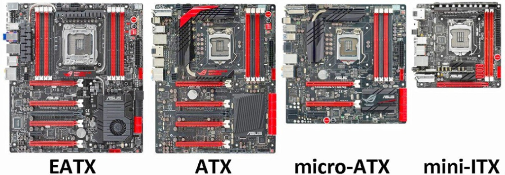
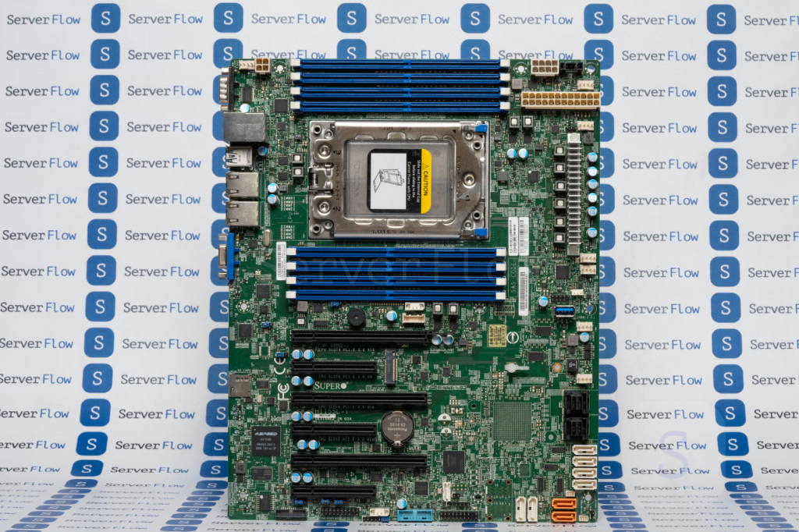
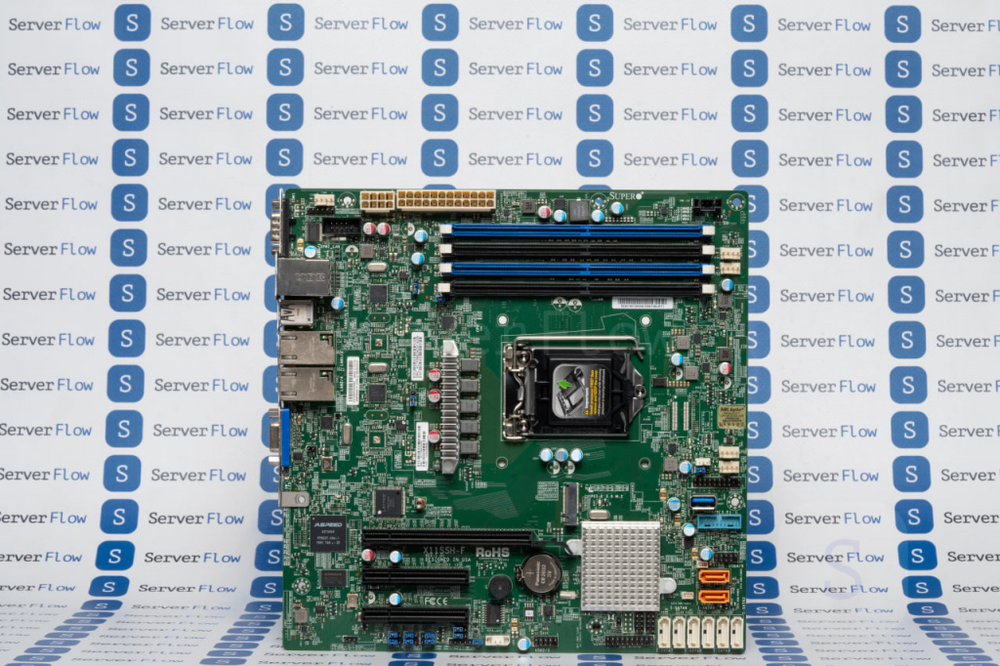
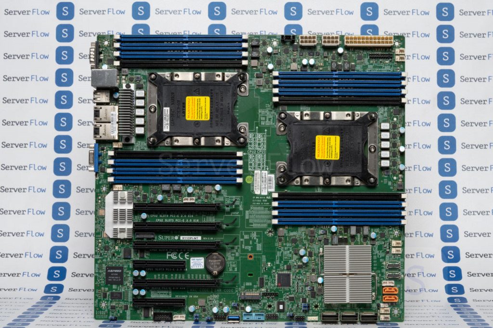

Форм-фактор – это стандарт, определяющий размеры, компоновку и расположение разъемов материнской платы. Он влияет на совместимость с корпусами, блоками питания, системой охлаждения и количеством слотов расширения. Выбор подходящего форм-фактора важен для сборки компьютера в зависимости от его назначения и будущих обновлений.

## Виды:
### ATX
**ATX** — это самый распространенный форм-фактор. Он был разработан компанией Intel в 1995 году. Основной задачей компании было добиться большей функциональности в сравнении с более старыми стандартами. Данный форм-фактор широко используется во многих офисных системах, так как он обеспечивает большое количество возможностей для расширений и модернизации. Этот стандарт имеет несколько разъемов для систем охлаждения, что обеспечивает надлежащую вентиляцию в корпусе. **Его размер составляет 30.5 на 24.4 см (12 на 9.6 дюймов).** Он помещается в mid или full tower корпуса. ATX имеет до семи слотов расширений. Благодаря своему размеру есть возможность подключения нескольких устройств PCI-e или даже построение multi GPU системы. Этот форм-фактор поддерживает больший объем оперативной памяти, чем Micro-ATX или Mini-ITX, что наилучшим образом подходит для построения производительных рабочих станций. Из недостатков можно отметить высокую цену и невозможность установки в компактные корпуса.

### Micro-ATX
**Micro-ATX** представляет собой компактный форм-фактор **размером 24.4 на 24.4 см (9.6 на 9.6 дюймов),** меньший, чем ATX, но больший, чем Mini-ITX. Такая материнская плата может быть легко установлена в mid tower, full tower. Также, благодаря размеру, есть возможность установки габаритной системы охлаждения. Одно из достоинств форм-фактора в том, что он может поддерживать до четырёх слотов DIMM для расширения RAM при своем скромном размере. Также, Micro-ATX подходит к single gpu системам, и, как правило имеет меньшее количество PCI-E слотов. Таким образом, Micro-ATX платы имеют меньше слотов для расширения и портов по сравнению с стандартными ATX, но они все равно предоставляют достаточный функционал для большинства пользователей. Они могут использоваться в компактных корпусах, что делает их отличным выбором для HTPC (Home Theater PC) или офисных систем. Micro ATX платы доступнее в цене по сравнению с более крупными форм-факторами. Это делает их привлекательным выбором для тех, кто хочет построить бюджетную систему без ущерба производительности.

### EATX
**EATX (Extended ATX)** — это расширенный форм-фактор материнских плат, **размером 30.48 на 33.02 см (12 на 13 дюймов)** или больше, который представляет собой увеличенную версию стандартного ATX. Благодаря этому, есть возможность разместить большее количество слотов расширений, портов и компонентов. EATX был разработан для обеспечения большей масштабируемости для пользователей, которым требуется высокая производительность и большое количество слотов для расширений.
EATX форм-фактор чаще всего используется в высокопроизводительных рабочих станциях, серверах и других профессиональных системах, где требуется максимальная производительность и возможности расширения. Среди недостатков можно выделить тот факт, что материнские с таким форм-фактором дороже других, а также то, что их конструкция рекомендуется для установки только в Full-tower корпуса (возможна установка и в mid-tower, но перед покупкой нужно удостовериться в их совместимости).

Несмотря на то, что EATX платы могут быть более дорогими и требовательными к корпусам, они предоставляют пользователю возможность создать максимально мощную и расширяемую систему.

### EEATX

Данный форм-факт используется в rackmount серверных системах. **Его размер это 34.7 на 33 см (12 на 13 дюймов),** его отверстия совпадают с ATX. Является увеличенной версией стандарта EATX.

  

### SSI EEB и SSI CEB

**SSI EEB** — это форм-фактор, **размеры которого составляют 30.5 на 33 см (12 на 13 дюймов),** который создан для поддержки двух и более процессоров. Его конструкция подходит для рабочих станций, основанных на процессорах Intel Xeon и AMD EPYC (С621/C741 чипсеты).

SSI CEB имеет такой же функционал, но отличается **размером** в меньшую сторону, а именно **30.5 на 26.7 см (12 на 10.5 дюймов).**

### Proprietary

Данный форм-фактор **не имеет конкретных размеров** и функционала, так как разрабатывается под конкретные сервера. Встречается в материнских платах от компаний: Supermicro, Intel, Asrock, Asus, Gigabyte.
### Источники:
- https://serverflow.ru/blog/stati/form-faktory-materinskoy-platy/

