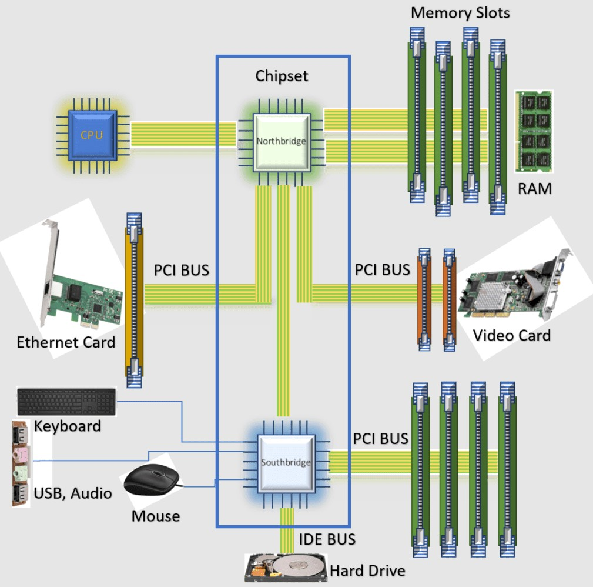

**Чипсет –** набор микросхем, управляющий взаимодействием между центральным процессором и остальными компонентами системы. Он обеспечивает подключение накопителей, слотов расширения, сетевых и периферийных интерфейсов.
Функции:
- Управление связью компонентов
- Поддержка интерфейсов
- Поддержка разгона процессора и памяти
- зависит кол-во PCIe-линий
- управление работой USB, COM, TPM
- доступ к BMC, IPMI, Redfish

### Функции именно серверных чипсетов
- Встроенные функции RAID для NVMe и SAS/SATA накопителей(В некоторых платформах поддерживается VROC (Virtual RAID on CPU) – технология Intel, позволяющая использовать RAID для NVMe-дисков при помощи чипсета и лицензии, без необходимости ставить отдельный RAID-контроллер)
- Работа с PCIe и расширение числа линий
Процессоры предоставляют ограниченное количество PCIe-линий, и, если этого недостаточно для всех устройств – на помощь приходит отдельный набор микросхем. Он может содержать собственные PCIe-линии, которые доступны независимо от тех, что предоставляет серверный центральный процессор.Такие линии обычно подключаются к менее критичной периферии – например, сетевым адаптерам, USB-контроллерам, дополнительным накопителям или картам расширения. Иногда используется гибридная логика: часть линий напрямую от CPU, часть через набор схем. Это позволяет гибко настраивать конфигурацию сервера без перераспределения ядер или перестановки устройств между сокетами.
- Возможность работы со средствами администрирования
Чипсет может взаимодействовать с контроллерами управления, которые обеспечивают удаленный доступ к серверу. Это позволяет отслеживать температуру, управлять питанием, перезагружать машину и обновлять прошивку без ОС. Через чипсет осуществляется связь с BMC (Baseboard Management Controller), а также с интерфейсами IPMI и Redfish. Это стандарт для всех современных серверных решений, особенно в корпоративной среде. Без этой связки удаленное управление невозможно, а значит – и полноценная работа сервера в стойке или дата-центре.
### Дополнительно
Современные серверные платформы переходят к SoC, в которой все больше функций «переезжает» в CPU. В случае с подходом System on Chip (SoC) основная логика платформы сосредоточена в самом процессоре. Последний берет на себя функции работы с памятью, PCIe, контроллерами ввода-вывода, часто даже сетевыми интерфейсами. Это упрощает материнскую плату, сокращает задержки, уменьшает энергопотребление. Переход к SoC особенно заметен в платформах с процессорами AMD EPYC (SP5, SP6), в решениях на базе ARM, где отдельного набора микросхем просто нет – вся логика встроена в один или несколько кристаллов CPU. Чипсет становится не обязательным компонентом, а скорее вспомогательной частью для узкоспециализированных задач.

Раньше чипсет делился на два моста: северный и южный. Северный мост отвечал за работу с оперативной памятью, шиной PCIe и связь с процессором, а южный – за USB, накопители, сеть, звук и другую периферию. Со временем производители начали переносить функции северного моста прямо в процессор. Intel сделала это одной из первых, встроив в CPU контроллер памяти и PCIe. Южный мост остался, но как единственная микросхема – собственно, чипсет.  Дальше уже функции южного моста начали перекочевывать в CPU. Особенно активно это происходит в серверных платформах, где важны плотность, стабильность и скорость обмена данными. Сейчас классический чипсет встречается все реже. Его задачи либо встроены в CPU, либо распределены между другими компонентами.

У Intel связь между CPU и чипсетом организована через интерфейс DMI (Direct Media Interface). Это выделенный канал, по которому проходит весь обмен между центральным процессором и чипсетом. На современных платформах, например с сокетом LGA4677 (Xeon Scalable), используется DMI 4.0 или DMI 5.0 – с высокой пропускной способностью и низкими задержками. У AMD подход другой. Во всех современных платформах на базе EPYC функции отдельного набора микросхем фактически встроены в сам процессор. Внутри CPU несколько кристаллов соединены между собой через скоростную внутреннюю шину (Infinity Fabric). Связь между логикой и ядрами реализована внутри корпуса CPU, без отдельного внешнего интерфейса к чипсету. Поэтому выделенного чипсета у AMD на серверных платформах нет – вся логика работает непосредственно в процессоре.
#### AI-инструкции и ускорители
Если чипсеты хотят остаться на плате, им нужно стать полезными. Один из вариантов – интеграция искусственного интеллекта. Это могут быть модули NPU (Neural Processing Unit), которые ускоряют задачи машинного обучения, предобработки данных, аналитики и безопасности прямо на уровне системной логики. Такой чипсет сможет брать на себя работу по анализу телеметрии сервера, обеспечивать интеллектуальное распределение нагрузки, автономную работу систем охлаждения или даже локальную AI-обработку логов и событий.
Для этого потребуется интеграция:

- AI-инструкций на аппаратном уровне;
- микроускорителей NPU или DPU;
- расширенной логики анализа состояния системы;
- поддержки новых интерфейсов взаимодействия с CPU и BMC.
Без этого чипсет окончательно растворится внутри процессора. Добавление AI-возможностей – один из немногих путей сохранить его актуальность.
### Источники:
- https://serverflow.ru/blog/stati/servernye-chipsety-kak-oni-rabotayut-i-chem-otlichayutsya-ot-desktopnykh/

