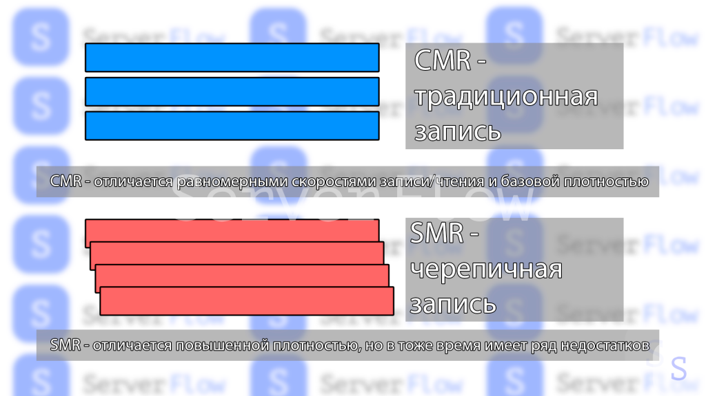

**HDD (жесткий диск)** — это устройство для хранения данных, широко используемое в компьютерах и серверах. HDD необходимы для долговременного хранения больших объемов данных и обеспечивают надежное и доступное решение для работы с информацией в различных сферах, от домашних компьютеров до корпоративных серверов.
HDD устроен так:
1. Внутри металлической коробки находятся несколько вращающихся дисков, покрытых смесью металла и стекла. Они «запоминают» информацию, используя свойства магнитного поля.
2. Для чтения и записи информации используется специальный кронштейн, который называют коромыслом На его конце находится много магнитов. Пролетая над пластиной с записанной информацией, магниты считывают единицы и нули и могут менять их последовательность.
3. Коромыслом и дисками-пластинами управляет специальный чип-контроллер. Он запоминает, куда на каком диске записаны те или иные данные, и координирует запись и чтение файлов. Также он отвечает за «общение» жесткого диска с остальным компьютером и пользователем.
В современных компьютерах HDD-диски не подойдут для установки операционной системы и ресурсоемких игр — компонент станет «бутылочным горлышком» для более быстрых деталей, и весь компьютер будет работать медленно. Жесткие диски уже достигли лимита производительности: они не могут находить и записывать файлы достаточно быстро из-за ограничений своей конструкции.
Тем не менее HDD все еще можно найти применение. У них есть свои сильные стороны:
1. Данные с HDD можно восстановить после удаления. Жесткий диск хранит записанные данные в одном и том же месте, в то время как SSD постоянно их перемещает. Из-за этого данные с жесткого диска можно попытаться восстановить — иногда это спасает семейный фотоархив или ценные документы в случае поломки или несчастного случая.
2. HDD значительно дешевле. Если высчитывать стоимость одного гигабайта, то жесткий диск от 2 до 10 раз выгоднее, чем современные SSD. Правда, скорость и надежность при этом не учитываются.
Виды:
- клиентские 
- серверные(более высокое среднее время наработки на отказ (MTBF), скорость вращения шпинделя 5400,7200,10000,15000 об/мин)
### Интерфейс подключения

Существует два основных интерфейса: SATA и SAS, каждый из которых имеет свои особенности и преимущества.
*— SATA (Serial ATA)** интерфейс широко используется в потребительских HDD, обеспечивая достаточную скорость и производительность для настольных компьютеров и домашних серверов. SATA-диски предлагают скорости передачи данных до 6 Гбит/с, что подходит для большинства повседневных задач, таких как хранение файлов, игр и программ. Они также максимально совместимы со всеми видами материнских плат, что делает их удобным выбором для большинства систем.
**— SAS (Serial Attached SCSI)** интерфейс, напротив, предназначен для серверных HDD и обладает значительно лучшими характеристиками. SAS обеспечивает более высокую скорость передачи данных, достигая до 12 Гбит/с и выше (например, в 2020 году был представлен интерфейс SAS 24gb/s, но пока что он используется только в SSD накопителях), что делает его идеальным для корпоративных сред.

 
_Визуальное отличие коннекторов SAS и SATA на жестких дисках. Видно, что SAS имеет “перемычку” которая не позволяет подключить его привычным SATA кабелем._
### Таблица для сравнения основных характеристик SAS и SATA HDD

| **Характеристика**            | **SATA HDD**                                                      | **SAS HDD**                                          |
| ----------------------------- | ----------------------------------------------------------------- | ---------------------------------------------------- |
| **Частота вращения шпинделя** | До 7200 об/мин                                                    | До 15000 об/мин                                      |
| **Производительность**        | До 6 Гбит/с                                                       | До 12 Гбит/с                                         |
| **Режим работы**              | Полудуплексный(Одновременная передача данных лишь в одну сторону) | Дуплекс(Одновременная передача данных в обе стороны) |
| **Очередь команд**            | До 32                                                             | До 256                                               |
| **Подключение дисков**        | Прямое подключение                                                | Multipath I/O или прямое подключение                 |
| **Сценарий применения**       | Домашнее использование и офисные системы                          | Сервера, системы хранения данных                     |
| **Надежность**                | Подходит для хранения пользовательских файлов                     | Подходит для критически важных приложений            |
| **Время доступа**             | Около 7-9 мс                                                      | Около 3-4 мс                                         |
| **MTBF**                      | 1.2 - 2.0 миллиона часов                                          | 0.5 - 1.2 миллиона часов                             |
| **Уровень шума**              | Обычно ниже                                                       | Обычно выше                                          |
| **Поддержка команд**          | ATA                                                               | SCSI                                                 |

## Форм-факторы

Современный рынок накопителей предлагает разнообразие форм-факторов, каждый со своими преимуществами:
- **3,5 дюйма** — стандартный размер для настольных HDD. Они обеспечивают максимальную емкость (до 30 ТБ) при минимальной стоимости за терабайт. Оптимальны для стационарных систем и NAS-хранилищ.
- **2,5 дюйма** — компактный формат для ноутбуков и внешних накопителей. Современные модели достигают емкости 5 ТБ для HDD и 8 ТБ для SSD. Работают с меньшим энергопотреблением и обычно тише.
### Типы записи данных на HDD
#### CMR диски
Это диски, в которых применяется технология продольной записи, описанная выше. При использовании такой технологии вектор намагниченности каждого магнитного домена располагается продольно, то есть вдоль поверхности диска. В зависимости от направления магнитного поля каждый участок считывается как ноль или единица. Именно с этой технологии начиналось развитие HDD, так как более ранние методики не позволяли достигать приемлемой плотности записи данных.  
Основной недостаток таких жестких дисков – низкая плотность записи, не превышающая 23 Гбит\дюйм, поэтому к 2010 году от их использования почти полностью отказались.
#### PMR диски
Диски, выполненные с использованием метода перпендикулярной записи пришли на смену CMR-дискам. Они позволили решить их основную проблему – низкую плотность записи. Суть метода заключается в том, что намагниченность домена располагается не продольно, а перпендикулярно поверхности пластины. Это позволило существенно уменьшить площадь каждого домена, но для записи потребовалось использовать гораздо более мощные магниты в головке и более чувствительные методики считывания информации.
#### SMR диски

В таких HDD используется новейшая разработка «черепичной» записи. Хотя сама технология появилась более 10 лет назад, широко применять ее начали только сейчас. Главная особенность метода SMR состоит в частичном наложении каждой группы дорожек на следующую, подобно тому, как укладывается черепица на кровле. Она не стала радикальным новшеством, таким как PMR, можно сказать, что SMR является эволюцией PMR метода.  
Использование SMR позволяет дополнительно нарастить плотность записи, в сравнении с обычной PMR (примерно на 20%). Но использование SMR сопряжено с серьезным недостатком – существенным замедлением скорости перезаписи, так как необходимо каждый раз при перезаписывании даже отдельных битов осуществлять стирание и запись всего пакета перекрывающихся дорожек. Поэтому в жестких дисках для обычных компьютеров SMR-диски не прижились, но они широко используются в центрах обработки данных и архивах для хранения WORM-данных, которые редко перезаписываются, но часто считываются. Для хранения такой информации SMR диски оптимальны, а их недостатки не существенны. Вероятнее всего, что технология дальнейшего развития не получит, но просуществует какое-то время в качестве нишевой, до момента появления более перспективных типов записи.

## Гелиевые hdd

Практически все самые емкие и производительные жесткие диски, выпускаемые в последние годы относятся к категории «гелиевые». Это означает, что гермоблок в них действительно полностью герметичен, а вместо воздуха в него закачивают инертный газ – гелий, поэтому и диски получили название «гелиевые».  
Использование гелия в качестве «наполнителя» таких дисков позволило получить ряд преимуществ. Благодаря тому, что плотность гелия в 7 раз меньше, чем у воздуха, удалось существенно улучшить аэродинамические характеристики головки чтения\записи. В самых продвинутых серийных образцах высота парения снизилась до 5 нм, что позволило повысить точность записи и считывания данных. Во многом благодаря этому инженерам удалось довести технологию HAMR до промышленного уровня.

К другим преимуществам гелиевых дисков можно отнести:
- Уменьшенное энергопотребление. В среднем гелиевые диски потребляют на 2 Вт меньше энергии в сравнении с воздушными аналогами, поэтому меньше греются и требуют меньше энергии для питания, что особенно важно для крупных серверов и ЦОДов.
- Снижение уровня шума и вибраций. Это обеспечила улучшенная аэродинамика и низкая плотность гелия.
- Увеличение объема одного диска. Благодаря снижению турбулентности и механических нагрузок в гелиевой атмосфере инженеры смогли использовать пластины меньшей толщины и увеличить их количество в одном диске сначала до пяти, а потом и до шести. В перспективе могут появиться пластины с восемью и даже десятью пластинами.
- Повышения срока безотказной работы. Согласно исследованиям инженеров Seagate гелиевые диски в среднем работают вдвое дольше «воздушных». Повышение срока наработки на отказ достигнуто за счет химической инертности гелия и полной герметичности корпуса диска. Это обеспечило радикальное снижение скорости износа «внутренней начинки» дисков, так как в гелиевой атмосфере практически не происходит окисление, также внутрь диска не проникают водяные пары.
### Источники:
- https://serverflow.ru/blog/stati/zhyestkie-diski-dlya-servera-i-dlya-domashnego-kompyutera-skhodstva-i-razlichiya/
- https://serverflow.ru/blog/stati/smr-cmr-pmr-vse-o-zhestkikh-diskakh-i-tekhnologiyakh-ikh-izgotovleniya/

