Твердотельные накопители (SSD) – современный стандарт хранения данных, обеспечивающий высокую скорость работы, надежность и низкое энергопотребление. В отличие от традиционных жестких дисков, SSD не имеют механических частей, что значительно увеличивает их долговечность и снижает вероятность механических повреждений.
Основные компоненты SSD:
- **Микросхемы NAND Flash** – основа хранилища данных
- **Контроллер** – управляет процессами записи, чтения и кеширования
- **Кеш-память (DRAM или SLC-кеш)** – ускоряет обработку операций
- **Интерфейс подключения** – SATA, PCIe NVMe, USB, mSATA
- Флэш-память – используется для хранения данных в виде флеш-чипов.
- Элементы управления питанием – обеспечивают стабильное напряжение и защиту от перенапряжений в цепи питания.
Принцип работы SSD состоит в использовании флэш-памяти для распределения пространства. При записи информации контроллер разбивает файлы на блоки и записывает их на доступные кластеры памяти. Если свободного места не осталось, то контроллер осуществляет процедуру сборки мусора, при которой происходит копирование данных с заполненных частей на новые свободные. При чтении контроллер запрашивает информацию у флэш-памяти и передает ее на компьютер.
Главные особенности SSD:
1. Высокая скорость. SSD могут передавать информацию со скоростью 550—12 000 Мб/с, это от 6 до 125 раз быстрее, чем у HDD. Даже самый примитивный SSD сделает компьютер быстрее и отзывчивее.
2. Надежность. SSD не содержат движущихся частей, а значит, их гораздо сложнее повредить, например, уронив. Конечно, сломать можно любой диск, но непреднамеренные поломки твердотельных накопителей случаются реже.
3. Компактность. Некоторые SSD меньше, чем половина кредитной карточки и весят менее 20 граммов. Есть и более крупные варианты, но и они занимают меньше места, чем классические HDD. К тому же жесткие диски еще и шумят при работе, а SSD не издают ни звука.

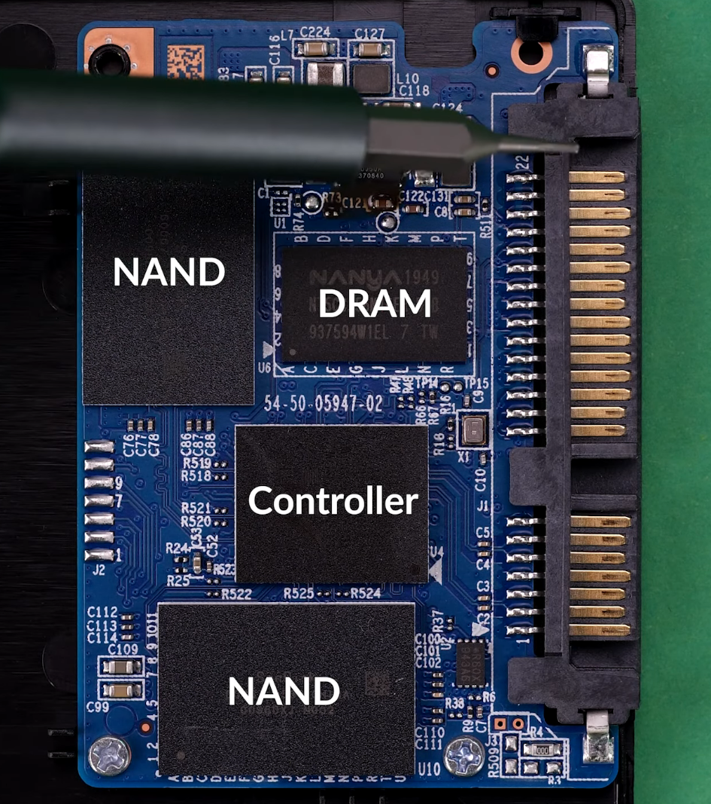
Логические интерфейсы:
- SATA
- NVMe
Физический интерфейс:
- msata
- pcie
- u.2
- m.2
- sata через sata-кабель
Форм-фактор:
- sata ssd 2,5 
- msata
- m.2
- ssd pcie
- ssd 2.5 u.2
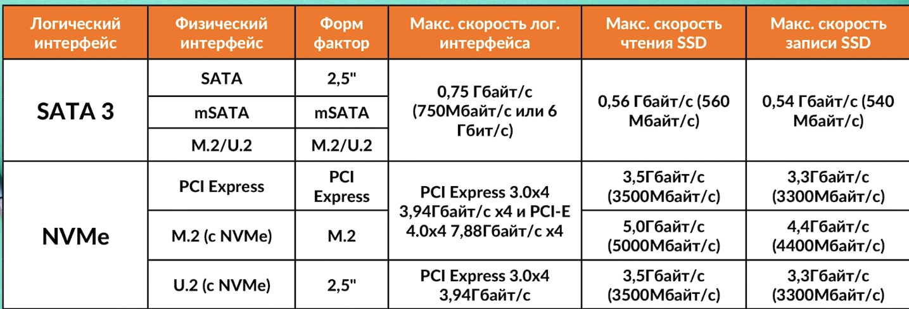
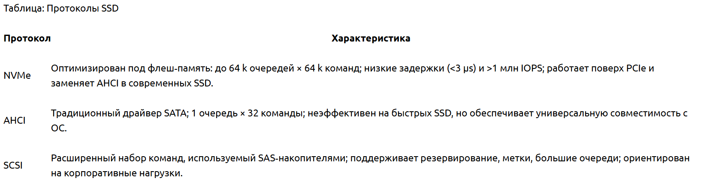
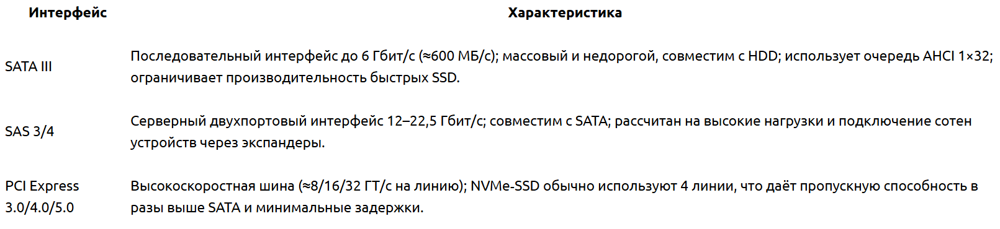
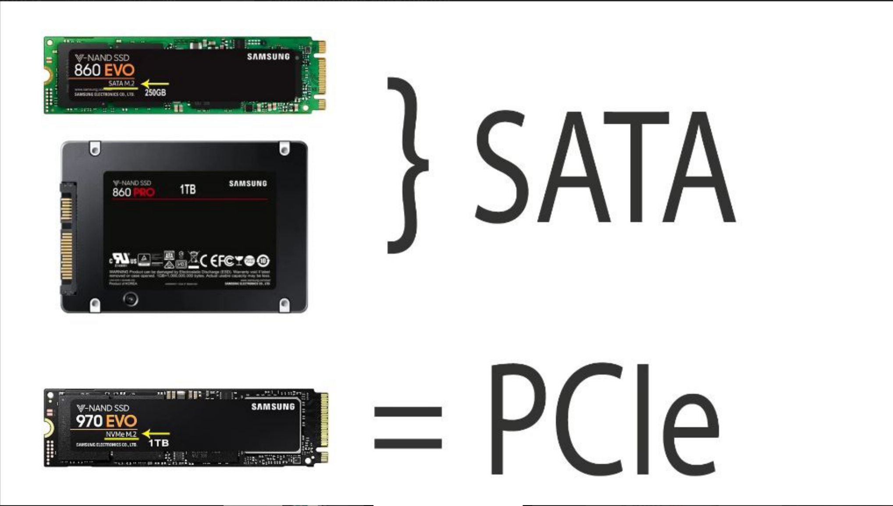

Единственная причина, по которой SSD диски полностью не захватили рынок – повышенная стоимость за единицу памяти в сравнении с HDD. Когда при создании сервера ограничен бюджет, многие делают выбор в пользу устаревших дисков с магнитными пластинами.

## Форм-факторы твердотельных накопителей: 2,5 дюйма, M.2, mSATA и U.2.
**2.5”**  
При покупке твердотельных накопителей первое, что вам нужно знать, — это какой форм-фактор подходит для вашей системы. Есть твердотельные накопители различных форм и размеров. Например, наиболее распространены 2,5-дюймовые твердотельные накопители, которые подходят для большинства портативных или настольных компьютеров. Они похожи по форме на традиционные жесткие диски (HDD) и подключаются через кабели SATA, поэтому их использование не будет отличаться от того, к чему многие уже привыкли.
- Подключение через SATA,SCSI
- Область применения: Ноутбуки, настольные компьютеры, компактные серверы и внешние накопители. 2,5-дюймовые SATA SSD обеспечивают заметный рост быстродействия по сравнению с HDD, оставаясь совместимыми и доступными по цене.

**M.2**  
Другой форм-фактор, M.2, стал стандартным типом хранилища для тонких портативных компьютеров и ноутбуков. Его крошечный форм-фактор часто сравнивают с пластинкой жевательной резинки, и в большинстве случаев его легко установить прямо на материнскую плату. Доступны твердотельные накопители разной длины и, соответственно, разной емкости: чем длиннее накопитель, тем больше микросхем флеш-памяти NAND можно в нем установить, что увеличивает емкость накопителя.
- Подключается через SATA, PCI Express. M.2 SSD могут работать либо через шину SATA (с использованием протокола AHCI, аналогично 2,5” дискам), либо через шину PCIe с протоколом NVMe. Конкретный интерфейс зависит от модели накопителя и разъёма: существуют M.2 SATA SSD и M.2 NVMe SSD.  Для NVMe-накопителей M.2 обычно выделяется 4 линии PCIe (x4), что даёт значительно более высокую пропускную способность – современные PCIe SSD работают в разы быстрее SATA. AHCI используется только в SATA-режиме; при подключении через PCIe применяется NVMe – специальный высокопроизводительный протокол для работы с флеш-памятью.
- Область применения: Тонкие ноутбуки, ультрабуки, а также настольные ПК и рабочие станции. M.2 подходит как для потребительских задач (вместительные SATA M.2 для хранения данных), так и для высокопроизводительных приложений (скоростные NVMe SSD на PCIe для игр, мультимедиа, баз данных и т.д.). В серверном сегменте накопители M.2 также используются, но обычно только для загрузочных дисков, поскольку они не рассчитаны на горячую замену и ограничены по охлаждению.
 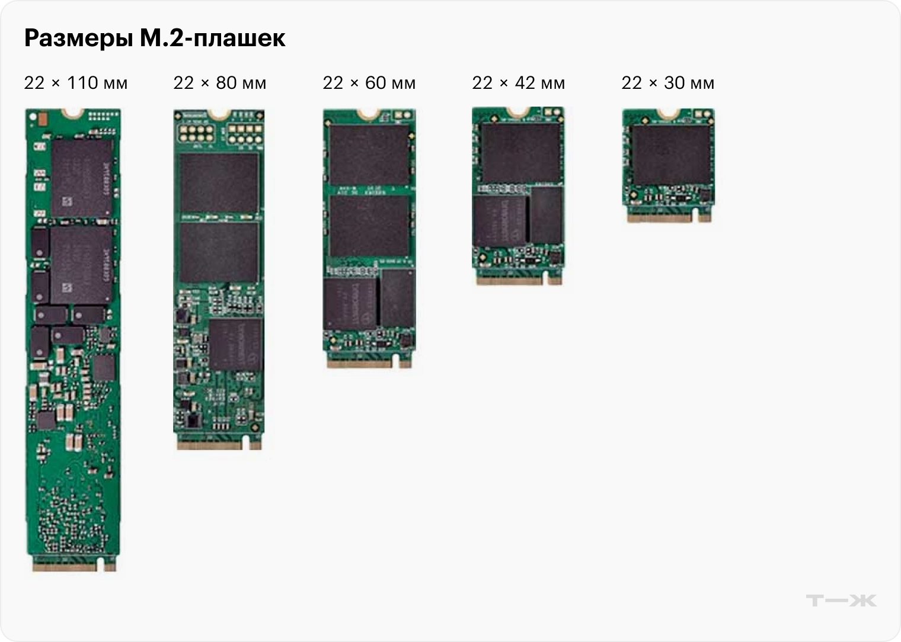
#### Что такое «ключ» (M.2 key)
У модулей M.2 по кромке контактов сделаны вырезы-«ключи».  
Они механически не дают вставить плату в несовместимый разъём и одновременно показывают, какие шины и сигналы выведены на контакты. В спецификации определено 12 позиций (A - M), но в реальных ПК и ноутбуках сегодня встречаются пять:
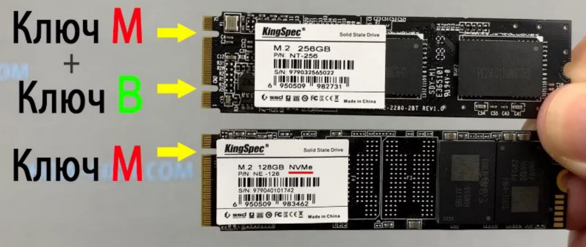

| Ключ  Линии PCIe / другие интерфейсы | Типичные устройства                           |
| --------------------------------------- | --------------------------------------------- |
| B-key до PCIe ×2, SATA 6 Гб/с, USB 2/3  | SATA-SSD, NVMe-SSD ×2, WWAN-модемы            |
| M-key до PCIe ×4, SATA 6 Гб/с           | Быстрые NVMe-SSD ×4                           |
| B + M PCIe ×2 или SATA (два выреза)     | Универсальные SATA-SSD и «медленные» NVMe-SSD |
| A-key PCIe ×1, USB 2/3, SDIO, I²C       | NFC, Thunderbolt add-in                       |
| E-key PCIe ×1, USB 2/3                  | Wi-Fi/Bluetooth адаптеры                      |
##### Совместимость
- B-key слот принимает B-key и B + M модули, но не M-key.
- M-key слот принимает M-key и B + M; B-key вставить нельзя.
- B + M модуль универсален по механике, но по спецификации имеет только две линии PCIe, то есть даже в M-key слоте разгоняется лишь до скорости PCIe ×2.
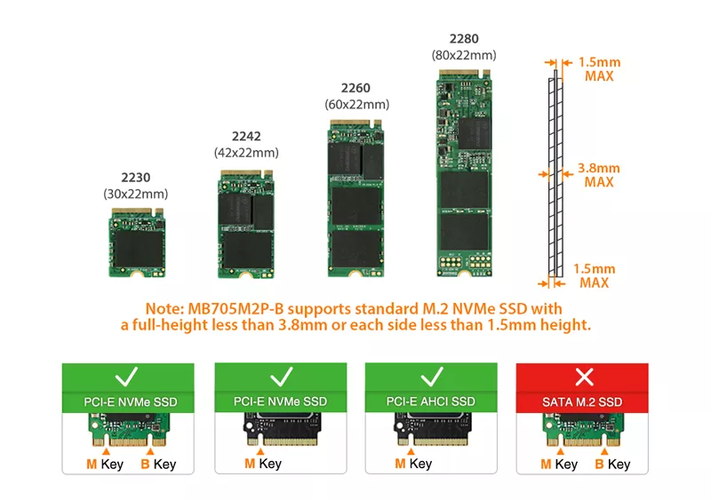

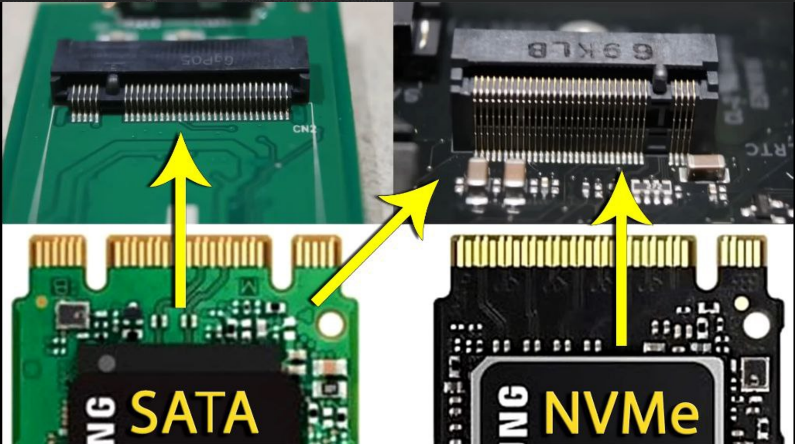
**mSATA**  
mSATA, или mini-SATA, — это, по сути, уменьшенная версия полноразмерного твердотельного накопителя SATA. Он имеет компактный форм-фактор, как и M.2, но они не являются взаимозаменяемыми. Накопители M.2 могут поддерживать интерфейсы SATA и PCIe, тогда как mSATA поддерживают только SATA. Этот форм-фактор разработан для систем меньшего форм-фактора, пространство в которых ограничено.
- Подключение через SATA
- Область применения: ноутбуки, ультрабуки, планшеты ранних годов, а также встраиваемые системы, POS-терминалы, промышленные ПК, где важны компактность и низкое энергопотребление.

**U.2**  
Наконец, есть накопители U.2, которые выглядят как 2,5-дюймовые накопители, но имеют немного большую толщину. Он использует другой разъем и отправляет данные через интерфейс PCIe. Технология твердотельных накопителей U.2 обычно предназначена для высокопроизводительных рабочих станций, серверов и корпоративных системы, в которых требуется больший объем хранилища. Он может работать при более высоких рабочих температурах и более эффективен для передачи тепла, чем форм-фактор M.2.
- Подключаются через PCI Express (через разъём SFF-8639) с протоколом NVMe. Некоторые бэкплейны U.2 способны работать и с SATA/SAS за счёт совместимости на уровне разъёма, но сами U.2-накопители ориентированы именно на PCIe. 
- Область применения: Высокопроизводительные рабочие станции, серверы и системы хранения данных. Форм-фактор U.2 разработан как замена SATA/SAS-дисков в корпоративном сегменте – он обеспечивает существенно более высокую скорость и IOPS, сохраняя удобство горячей замены дисков в стойке. U.2 SSD используются там, где нужны большие ёмкости и скорость (базы данных, системы Big Data, обработка видео и др.), а M.2 не подходит из-за ограничений по охлаждению и обслуживанию.

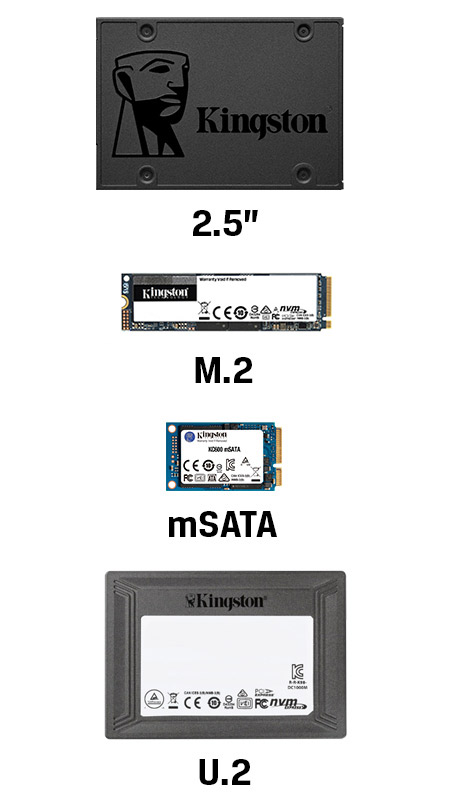

### U.3

U.3 – развитие форм-фактора U.2, предложенное для унификации подключения разных типов накопителей в серверах. Накопители U.3 физически аналогичны 2,5-дюймовым дискам с разъёмом SFF-8639, при этом разъём и бэкплейн стандарта U.3 могут автоматически поддерживать три протокола: SATA (AHCI), SAS (SCSI) и PCIe (NVMe). То есть в один и тот же отсек U.3 сервера можно установить либо SATA SSD, либо SAS SSD, либо NVMe SSD – контроллер сам переключится на нужный режим. Такая универсальность удобна в корпоративных системах. Сами же SSD U.3 обычно являются NVMe-накопителями, совместимыми с U.2 (U.3 диск может работать в старом U.2 слоте в режиме NVMe, и наоборот).

- Поддерживаемые интерфейсы: PCIe 3.0/4.0 NVMe, SATA 3 (6 Гбит/с AHCI), SAS 12 Гбит/с – выбор интерфейса зависит от типа вставленного накопителя и поддерживается бэкплейном/контроллером. Разъём SFF-8639 в версии U.3 распаян таким образом, чтобы обеспечить обратную совместимость и нужные сигналы для всех трёх протоколов.

Область применения: Серверы и дисковые массивы следующего поколения, где требуется гибкость – возможность на лету заменять SATA/SAS диски на NVMe. U.3 постепенно вытесняет U.2 в корпоративном секторе благодаря упрощению инфраструктуры (единые тримодовые бэкплейны для любых дисков).

## Интерфейсы подключения дисков
Всего существует 5 типов интерфейсов подключения дисков. Первые два (IDE и SCSI) мы не затрагиваем, т.к. это устаревшие технологии, которые давно не используются. Сегодня актуальны только три интерфейса:
- SATA: единственный интерфейс, через который подключаются накопители к домашним компьютерам. Пропускная способность достигает 6 Гбит/сек. Устройства с таким интерфейсом в среднем дешевле аналогов на SASи NVMe. Еще одно достоинство – совместимость между разными накопителями.
- SAS: интерфейс, предназначенный для использования в масштабных серверах. Совместим с RIADмассивами всех типов. Характеризуется высокой пропускной способностью (до 24 Гбит/сек) и отказоустойчивостью. Оптимальное решение с точки зрения сочетания цены и производительности.
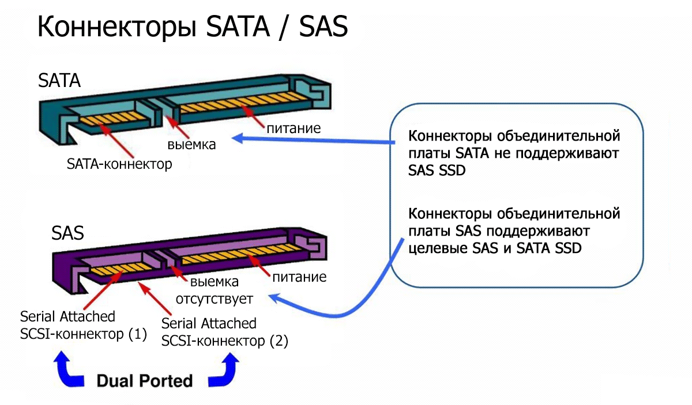
- NVMe: создан для дисков формата SSD. Предназначен для использования в шине PCI-E. Также можно подключить через m2 разъем на материнской плате или backplane
Обладает максимальной скоростью передачи данных и минимальным временем отклика. Интерфейс позволяет свободно обрабатывать большое количество запросов. Единственный недостаток – оборудование под данный интерфейс обходится дороже.
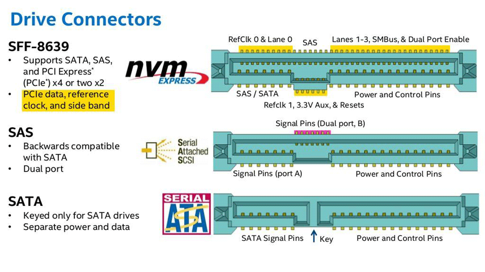

### Типы памяти по кол-ву битов в ячейке
Учитывая разные технологии хранения данных, встречаются следующие типы флеш-памяти:
1. SLC – хранит каждый бит данных на одной ячейке памяти, что дает высокую скорость чтения и записи, а также повышенную надежность. Однако обладает меньшей емкостью по сравнению с другими типами.
2. MLC – хранит несколько бит данных на одной ячейке. Обеспечивает большую емкость за счет более рационального использования ячеек, скорость чтения и записи ниже, а также есть высокий риск возникновения ошибок при обработке данных.
3. TLC – хранит 3 бита данных на одной ячейке. Такой подход позволяет увеличить емкость, однако скорость чтения и записи еще ниже. При этом риск возникновения ошибок еще выше, чем в случае с MLC.
4. QLC – хранит 4 бита данных на одной ячейке. Как и в других случаях, это позволяет повысить вместительность диска, но снижает скорость обработки информации и повышает риск потери данных.
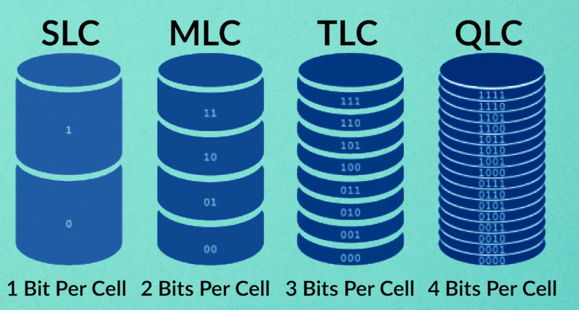
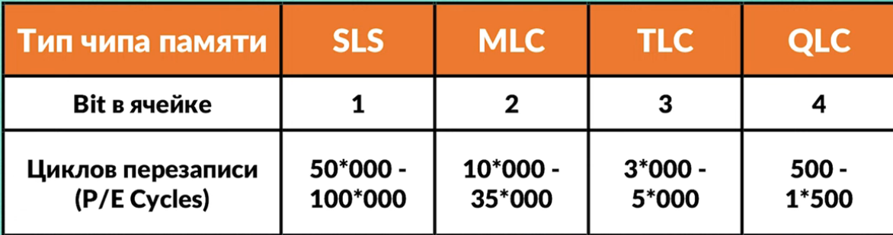

### Контроллер памяти

### Источники:
- https://habr.com/ru/companies/kingston_technology/articles/537856/
- https://habr.com/ru/articles/700528/
- https://ipboom.ru/info/articles/2025/osnovnye_form_faktory_ssd_i_interfeysy_peredachi_dannykh/
- https://www.youtube.com/watch?v=FEGOdkcYSdY

