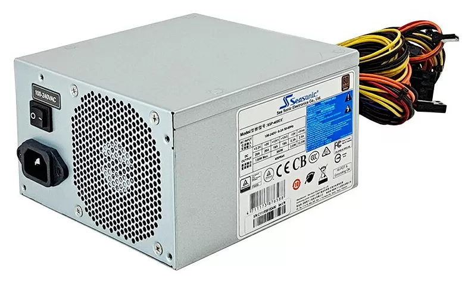
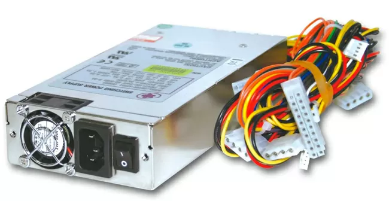
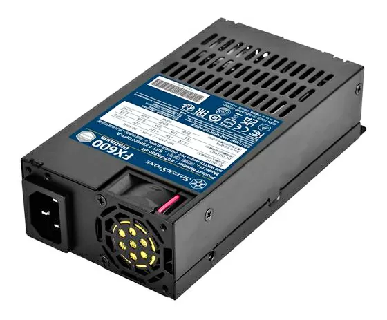
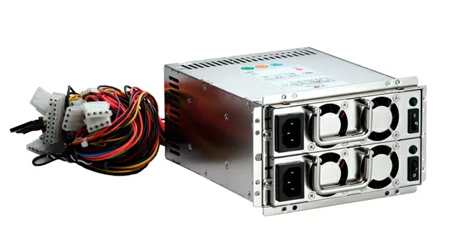
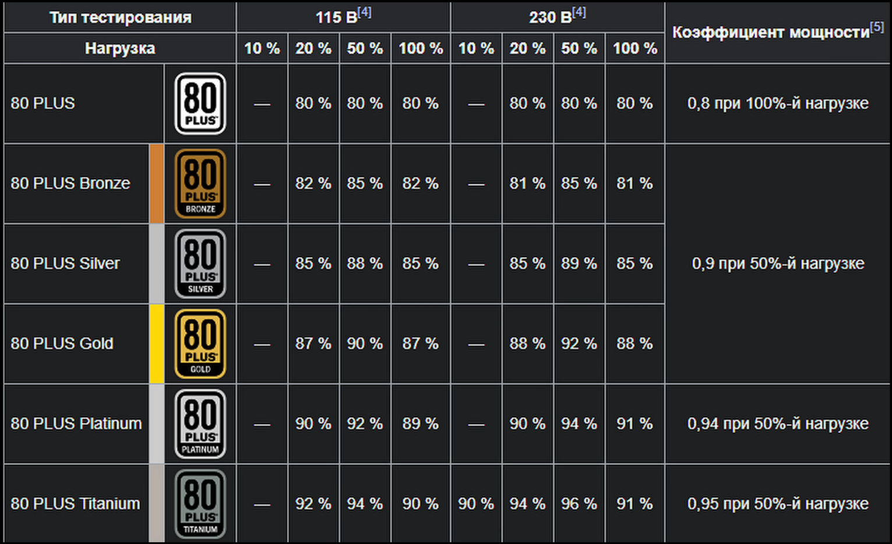

Серверные блоки питания, которые используются для обеспечения питания компонентов сервера, имеют различные параметры, такие как мощность, ток, и напряжение. В зависимости от типа серверного корпуса и его мощности, блоки питания делятся на разные категории.  
Характеристиками блока питания являются:
- мощность;
От мощности зависит, будет ли компьютер поддерживать обновления сервера, перегреваться, потреблять много электроэнергии.Чтобы подсчитать необходимое количество Ватт для компьютера, стоит воспользоваться калькулятором, например Cooler Master или MSI. Если мощность ниже необходимой, устройство будет нагреваться и шуметь, а детали – быстро изнашиваться. Производитель указывает максимально допустимую нагрузку, поэтому стоит брать товар как минимум на 30% мощнее необходимого.
- длина и вид кабелей;
Длина проводов – это в первую очередь эстетический вопрос. Чтобы система выглядела ухоженно, стоит выбрать БП с короткими кабелями, которые легко укладываются. Однако провода меньше 65 см могут просто не достать до разъема.
Если конструкция несъемная, то придется думать, как спрятать кабели. Если крепления частично модульные, то главные провода останутся на месте, а GPU и SATA при желании удастся убрать. Наиболее практична полностью модульная система.
- система охлаждения;
От качества системы охлаждения зависит долговечность блока и уровень шума. Разновидности:
1. Активная. Лопасть вращается беспрестанно. Характерна для недорогих устройств. Недостатки – шум, засасывание пыли.
2. Полупассивная. Останавливается при малой загруженности. Наиболее распространена.
3. Пассивная. В ней отсутствует вентилятор, БП работает беззвучно. Однако такие системы дорогостоящие и встречаются редко.
- набор разъемов
Перед покупкой стоит рассчитать тип и количество штекеров, которые будут использоваться в работе сейчас и в будущем, после апгрейда системы. Для каждого процессора понадобится свой 4-pin или 8-pin разъем, 6+2-pin – для графической карты, SATA – для хранилища
- размеры и конструктивные особенности устройства.
### Как работает блок питания для сервера?
Блок питания для серверов преобразует переменный ток (AC) из основной сети центра обработки данных в регулируемый постоянный ток (DC) для компонентов сервера. Он поддерживает стабильное напряжение и ток для поддержки процессоров, видеокарт, памяти и устройств хранения данных, обеспечивая стабильную работу даже при перепадах напряжения или высоких вычислительных нагрузках.

Блоки питания также оснащены интеллектуальными системами мониторинга и защиты, такими как защита от перенапряжения, перегрузки по току, перегрева и балансировка нагрузки для конфигураций с двойным резервированием. Эти средства защиты необходимы для обеспечения бесперебойной работы предприятий в критически важных ИТ-средах.
## Какие основные типы блоков питания используются в серверах?

Серверные блоки питания различаются по форм-фактору, уровню резервирования и коэффициенту эффективности:

| Тип блока питания                                  | Описание                                                                  | Общий случай использования                                   |
| -------------------------------------------------- | ------------------------------------------------------------------------- | ------------------------------------------------------------ |
| **Резервирование (с возможностью горячей замены)** | Двойные или тройные модули блока питания для защиты от сбоев              | Центры обработки данных, облачные среды                      |
| **без резервирования**                             | Один блок питания, обеспечивающий полную нагрузку системы.                | Серверы для малого бизнеса                                   |
| **Модульный блок питания**                         | Съемная конструкция кабеля для повышения эффективности воздушного потока. | Пользовательские сборки серверов                             |
| **Блок питания ATX / EPS**                         | Стандартный форм-фактор стойки и башни                                    | Серверы для малого и среднего бизнеса и крупных предприятий. |
Обычные ATX блоки питания  
Основной причиной использования обычных блоков питания в таких серверах является их доступная стоимость и простота замены в случае необходимости. В противоположность этому, для большинства серверов предпочтительнее использование более профессиональных блоков питания, так как они имеют более высокую надежность и продолжительность жизни, а также меньше шума. Нельзя гарантировать, что блок питания от игрового компьютера будет подходить для установки в сервер. Блок питания должен соответствовать требованиям определенного сервера по мощности, количеству разъёмов питания и длине кабелей. Но если эти условия соблюдены, в сервер можно установить игровой блок питания высокой мощности. Для традиционных блоков питания характерны мощности от 450 до 1200 Вт. Более мощные модели на 2000 Вт встречаются крайне редко, так как в оборудовании, требующем такую энергию, уже применяются отказоустойчивые БП. 
### Блоки питания формата 1U
1U блоки питания наиболее распространены в серверной индустрии. Они применяются в серверах и СХД с малым количеством дисков и других компонентов. 

Блок питания стандарта 1U имеет размеры: 
- Ширина: 80-100 мм (3.15 - 3.94 дюйма)
- Высота: 44,45 мм (1,75 дюйма)
- Глубина: 254 мм (10 дюймов) 

И хотя внешне они похожи на модели формата FlexATX, последние имеют другие размеры: 
- Ширина: 73,5 мм (3,11 дюйма)
- Высота: 40,5 мм (1,59 дюйма)
- Глубина: 150 мм (5,9 дюйма) 
Блоки питания стандарта FlexATX наиболее часто используются в компактных серверах, сетевых решениях, настольных NAS, оборудовании для видеонаблюдения и других устройствах, в которых размеры блока питания являются важным фактором. В каких-то случаях, серверный корпус может быть совместим как с 1U, так и с FlexATX блоком питания, но нужно учитывать, что глубина может меняться, в зависимости от мощности. Типичная мощность серверных блоков питания формата 1U может составлять до 750 Вт, а у FlexATX - до 500 Вт. В некоторых более мощных конфигурациях серверов могут использоваться блоки питания с мощностью до 1600 Вт.  
### Отказоустойчивые блоки питания 
Отказоустойчивые серверные блоки питания - это блоки питания, которые имеют несколько блоков (картриджей) с независимыми цепями питания. Если один блок перестает работать, то другие картриджи могут продолжать обеспечивать питание сервера, что значительно увеличивает надежность системы и предотвращает простои в работе.  

Каждый блок питания может иметь до четырех картриджей. Мощность каждого картриджа указывается на самом блоке питания, но суммарная мощность блока питания зависит от конфигурации (числа картриджей и их мощности), и может быть меньше суммы мощностей отдельных картриджей. Блоки питания от разных производителей могут быть совместимы между собой, но лучше использовать картриджи одного производителя. Разные блоки питания могут иметь разное количество AC гнезд на картридж (отдельное AC гнездо на каждый или одно AC гнездо на все картриджи). Количество гнезд зависит от физических размеров блока питания и технических возможностей обеспечить адекватную мощность при работе картриджей. Блоки питания с несколькими AC-гнёздами позволяют подключить сервер к различным источникам питания, например, к двум-трём ИБП одновременно, дополнительно повысив надёжность. В то же время, один общий AC-ввод позволяет сделать устройство более компактным, что важно для корпусов, предназначенных для установки в стойку. Для отказоустойчивых блоков питания характерны мощности от 450 до 2400 Вт.  
  

### Сертификация 80PLUS
Большинство производителей серверных блоков питания ориентируются на сертификацию 80Plus, которая является одним из основных стандартов в отрасли блоков питания. 80Plus сертифицирует блоки питания по их эффективности, гарантируя, что они будут потреблять меньше электроэнергии и производить меньше тепла при работе. 
Эффективность по стандарту 80Plus следующая (при питании от 230В): 
- Bronze: не менее 81% эффективности при нагрузке 20% и не менее 85% при 50% и 100% нагрузке; 
- Silver: не менее 84% эффективности при нагрузке 20%, не менее 88% при 50% и не менее 85% при 100% нагрузке; 
- Gold: не менее 87% эффективности при нагрузке 20%, не менее 90% при 50% и не менее 87% при 100% нагрузке; 
- Platinum: не менее 90% эффективности при нагрузке 20%, не менее 93% при 50% и не менее 90% при 100% нагрузке; 
- Titanium: не менее 90% эффективности при нагрузке 10%, не менее 96% при 20% нагрузке, не менее 94 % при 50% и не менее 91% при 100% нагрузке.  
  
  Разница в эффективности при различных напряжениях связана с разным КПД преобразователя, который изменяется в зависимости от входного напряжения. В целом, для серверных блоков питания считается оптимальным уровень сертификации от Gold до Platinum, так как он обеспечивает высокую эффективность и надежность работы и при этом не является избыточным для бизнеса.  
  

### Источники:
- https://serverflow.ru/blog/stati/vse-o-vidakh-form-faktorov-blokov-pitaniya-atx-sfx-tfx-i-drugie/
- https://hwp.ru/articles/gayd_po_servernym_blokam_pitaniya/
- https://www.youtube.com/watch?v=bil9vCMMsEA

