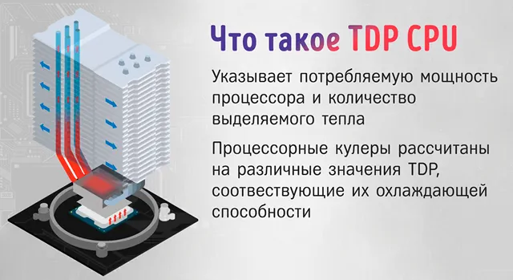
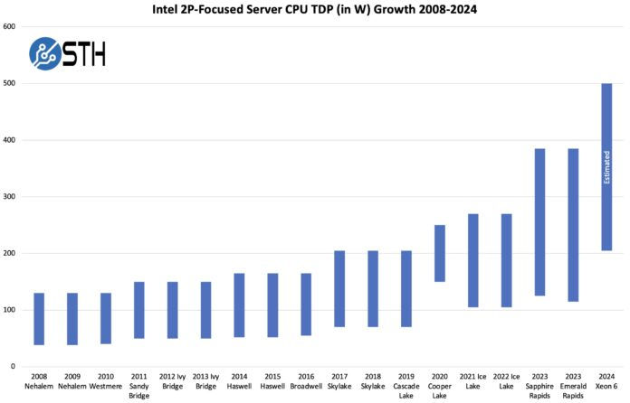
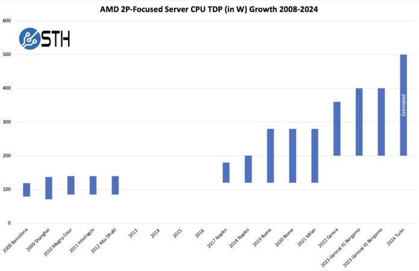

Абревиатура TDP (Thermal Design Power) обозначает конструктивные требования по теплоотводу или просто требования по теплоотводу для системы охлаждения. Если проще, TDP служит ориентиром для выбора системы охлаждения и отображает количество тепла, выделяемое устройством во время среднестатистической нагрузки. Значение TDP выражается в ваттах, и вот тут зачастую возникает путаница между TDP и энергопотреблением.

TDP измеряется в ваттах (Вт) и обозначает количество тепла, которое необходимо рассеять при стандартной нагрузке процессора. Производители процессоров, такие как Intel и AMD, указывают этот параметр в технических характеристиках. Однако фактическое энергопотребление может быть выше или ниже в зависимости от режима работы процессора и активации технологий динамического разгона, таких как Turbo Boost (Intel) или Precision Boost (AMD).

|**Параметр**|**Описание**|
|---|---|
|**TDP (Вт)**|Количество тепла, которое процессор выделяет в стандартных условиях|
|**Энергопотребление**|Реальное количество электроэнергии, потребляемое процессором|
|**Система охлаждения**|Кулер или жидкостное охлаждение, обеспечивающее рассеивание тепла|
## TDP и разгон

Во время разгона компонентов, будь то процессор или видеокарта, увеличивается их энергопотребление и, следовательно, увеличивается требование к системе охлаждения (TDP). Рост энергопотребления во время разгона может достигать 30, а то и 50% от базовых значений, соответственно и требования по охлаждению вырастут пропорционально.

Но и тут все не так просто. Если говорить про разгон в контексте энергопотребления, то ручная установка напряжения и частоты может понизить энергопотребление процессора во время работы и соответственно снизит требования по охлаждению.
_Например, процессор Ryzen 2700X в стоке потребляет 140 Вт и работает на частоте 4000 МГц при прохождении бенчмарка Cinebench R20. Во время ручного разгона процессор так же работает на частоте 4000 МГц, но потребляет всего 115 Вт. Результат производительности в обоих случаях идентичный._
### Темпы роста TDP серверных процессоров

### Источники:
- https://kompzhelezo.ru/processory/obshhaja-informacija-o-processorah/osnovnye-harakteristiki-processorov/tdp-processora/
- https://www.nix.ru/computer_hardware_news/hardware_news_viewer.html?id=213748
- https://webznam.ru/blog/chto_takoe_tdp_processora/2023-09-15-2395